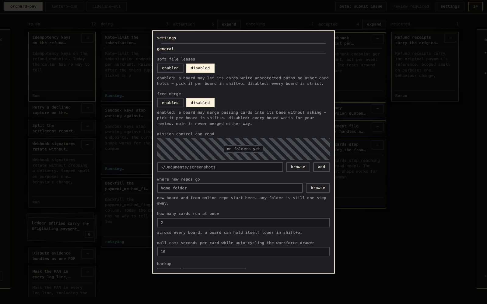
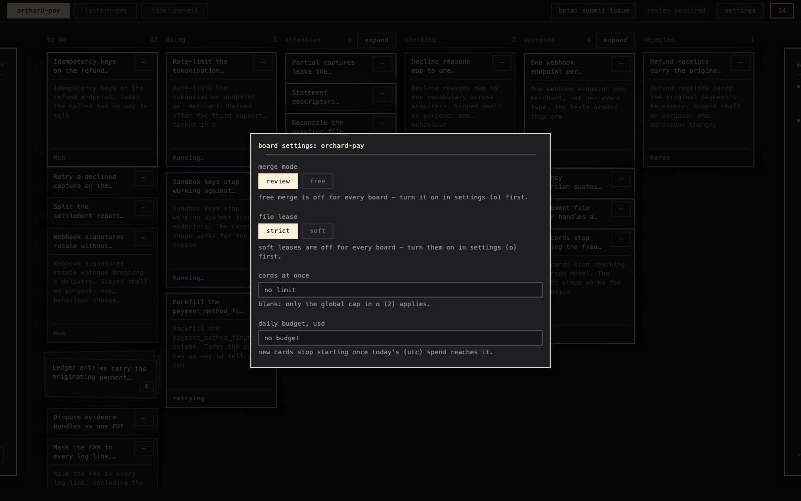
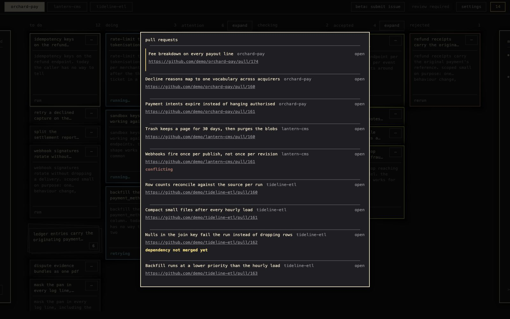
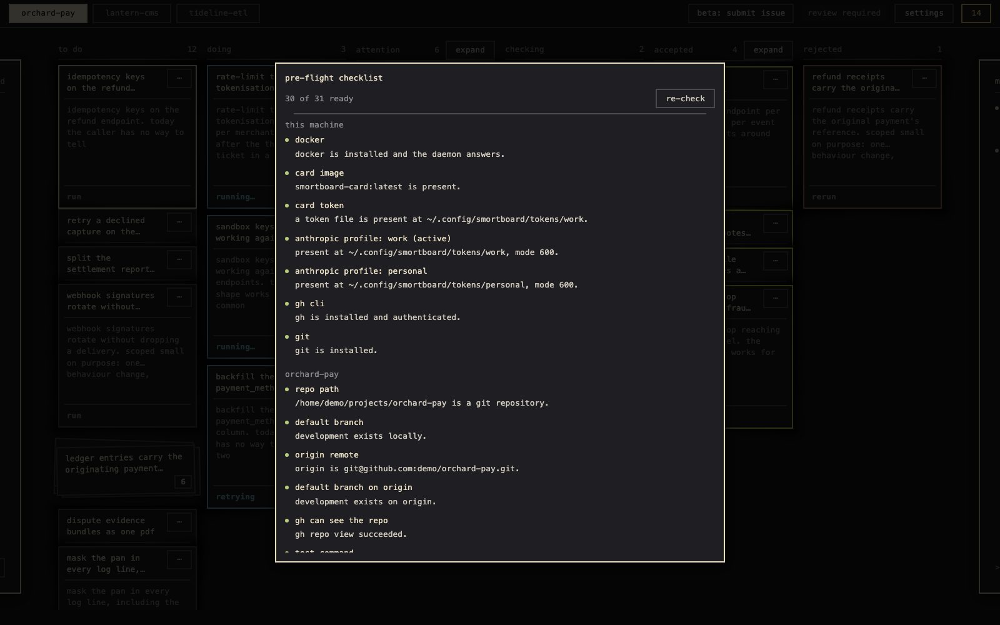
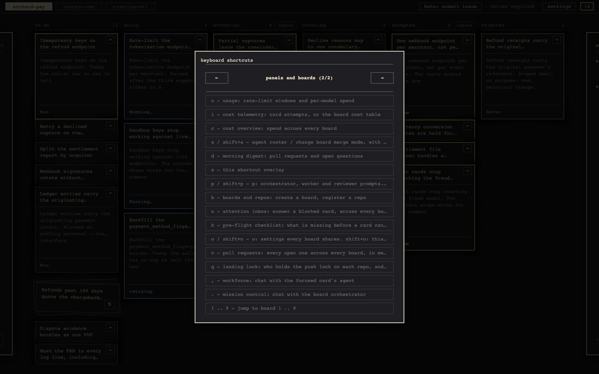

# smortboard

**kanban board that agents work, not you.** tell mission control what to build; it writes the
cards. each card's agent works in its own container, on its own branch, and writes the tests for
what it builds. the board runs them, a second agent reviews the diff. then your choice: the pull
request waits for you, or lands on `development` by itself once both pass. `main` is off limits to
every agent.


## what it does

**the board.** blue: agent on it. vanilla: waiting on you. lichen: accepted. queueing, retries after
a rate limit, rebasing a waiting pull request: the board does it.

**mission control and workforce.** `.` - say what to build; the orchestrator drafts the cards, each
with a file lease, a model and its dependencies. `,` - talk to a running agent; the note lands
between two tool calls, the run keeps going.


**attention.** one column to watch. a question, failed tests, a rejected review - anything the board
cannot retry itself - lands there and in the inbox `n`, each with its next step. answer it, the card
resumes.


**usage and cost.** rate-limit windows per subscription, spend per model, per card, per board. a
daily budget per board, a cap per run. limit hit: wait for the reset, ask you, or switch to your
next profile and then the fallback model.


**settings.** `o` for what every board shares: models per role, what a usage limit does, which
features boards may use. `shift`+`o` for one board: merge mode, file lease, parallel cap, budget.

<table>
<tr>
<td width="50%"><br><b>settings</b><br><code>o</code></td>
<td width="50%"><br><b>board settings</b><br><code>shift+o</code></td>
</tr>
</table>

## one key per screen

keyboard first. `s` lists the keys.

<table>
<tr>
<td width="50%"><br><b>open a card</b><br><code>space</code></td>
<td width="50%"><br><b>cost across boards</b><br><code>c</code></td>
</tr>
<tr>
<td width="50%"><br><b>card cost</b><br><code>i</code></td>
<td width="50%"><br><b>replay a run</b><br><code>t</code></td>
</tr>
<tr>
<td width="50%"><br><b>pull requests</b><br><code>v</code></td>
<td width="50%"><br><b>morning digest</b><br><code>d</code></td>
</tr>
<tr>
<td width="50%"><br><b>pre-flight</b><br><code>h</code></td>
<td width="50%"><br><b>every key</b><br><code>s</code></td>
</tr>
</table>

## setup: four steps

needs python 3.11+ with [uv](https://docs.astral.sh/uv/getting-started/installation/), docker
running, the [github cli](https://cli.github.com/) logged in, git, and claude code or codex locally
to mint a key.

1. **clone.**

   ```bash
   git clone https://github.com/BalthazarFitzpatrick/smortboard && cd smortboard
   uv sync
   docker build -f docker/card.Dockerfile -t smortboard-card:latest .
   uv run smortboard
   ```

   opens the board at the printed link. keep the terminal open.

2. **repo.** `b` -> **new board** -> pick a folder, or name a new one. the board adds what is
   missing: git, a `development` branch, a private github repo. it never pushes `main` - when it
   made the github repo, it shows you the one command to run. or **from online repo**: clone one of
   yours. tests are required. has tests: the board finds how to run them. has none: mission control
   writes a first suite, or you point at your own command.

3. **lab keys.** `claude setup-token` or `codex login` in your terminal. on the board: `shift`+`p`,
   add a profile, paste, activate. remove the empty `default`.

4. **`h`.** pre-flight checklist; a red row names its fix. all green: `.` to plan cards, `w` to run
   the board.

look before you set up: `uv run smortboard --demo` - throwaway board, invented cards, port 8001.
practice run: `uv run smortboard seed-beta <empty folder>` - a small game on a private github repo
and 15 written cards; you run one push command ([walkthrough](docs/beta-test-board.md)).

## best practices

- **let mission control write the cards.** one pull request each, criteria its own tests check,
  a lease no parallel card shares. read its plan before it creates them; steer a running card with
  `,`. [mission control](docs/practices/mission-control.md) - [cards](docs/practices/cards.md) -
  [leases](docs/practices/leases.md)
- **watch one column.** attention holds everything that needs you; the rest runs itself.
  [attention and inbox](docs/practices/attention.md)
- **let the two gates judge.** your tests, then a second agent, before any pull request. an agent
  saying the tests pass is not a pass. [the two gates](docs/practices/gates.md)
- **main is yours.** the board lands on `development`: by itself on a free-merge board once tests
  and review pass, or when you accept each card on a review-required board. a hook keeps agents off
  `main`.
  [landing](docs/practices/landing.md) -
  [protect main](docs/protect-main.md)
- **budget before you run.** a daily budget per board, a model per role, a fallback in another lab.
  [cost](docs/practices/cost.md) -
  [labs](docs/practices/labs.md)

## more

[all docs](docs/readme.md) -
[install in full](docs/get-started/install.md) -
[keyboard](docs/reference/keyboard.md) -
[configuration](docs/reference/configuration.md) -
[troubleshooting](docs/help/troubleshooting.md) -
[security](docs/reference/security.md)

**public beta.** one user, daily, on macos. found a rough edge?
[beta and reporting](docs/help/beta.md).

[mit](LICENSE)
