# smortboard

**A keyboard-first kanban board whose cards are worked by coding agents.**

You write a card and press a key. An agent picks it up in a sealed container and commits its work.
The board then re-runs the tests itself, has a second agent read the diff, and opens a pull request.
It never merges. Anything that needs you waits in one inbox.

## Start in a minute

**1. Install**, once:

- [Docker Desktop](https://www.docker.com/products/docker-desktop/), and keep it running
- [uv](https://docs.astral.sh/uv/getting-started/installation/)
- Claude Code: `npm install -g @anthropic-ai/claude-code`
- [GitHub CLI](https://cli.github.com/), then `gh auth login`. The board opens its pull requests
  through it.

**2. Get the board** and build the image cards run in:

```bash
git clone https://github.com/BalthazarFitzpatrick/smortboard && cd smortboard
docker build -f docker/card.Dockerfile -t smortboard-card:latest .
```

**3. Give it the key.** Cards use their own model-only token, never your Claude login:

```bash
claude setup-token
```

It prints the token once. Copy it, then on macOS:

```bash
mkdir -p ~/.config/smortboard
(umask 077; pbpaste | tr -d '\r\n ' > ~/.config/smortboard/card_token)
```

Linux and Windows: see [Setup](#setup).

**4. Start it:**

```bash
uv run smortboard
```

It opens http://127.0.0.1:8000/ui/index.html. Keep that terminal open. Closing it stops the board
and any card that is running.

**5. Board 1 and its repo:**

1. Press `b`. Type a board name and press Enter.
2. Register a repo on it: the path to a local clone of a GitHub repo, its default branch, and the
   command that runs its tests, e.g. `uv run pytest -q`. The board runs that command itself before it
   opens a pull request, so a repo without one can't finish a card. If the tests need more than git,
   uv and Python, give the repo its own image (see [Setup](#setup)).
3. Press `1` to open board 1.
4. Press `h`. The checklist shows anything still missing, and how to fix it.
5. Press `.` and tell the orchestrator what you want built. It answers with a plan and cards.
6. Pick a card and press `r`, or press `w` to run the whole board.

Anything that needs you lands in the inbox, `n`. The board never merges. You do.

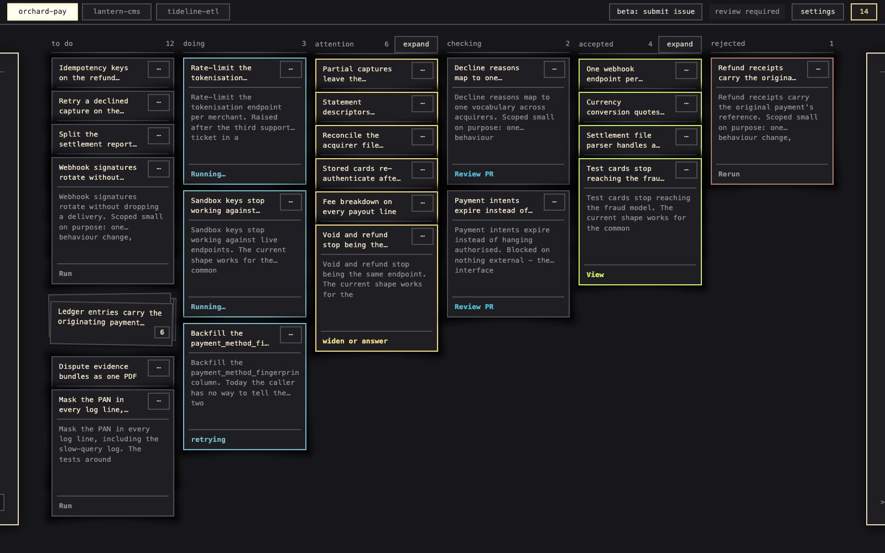

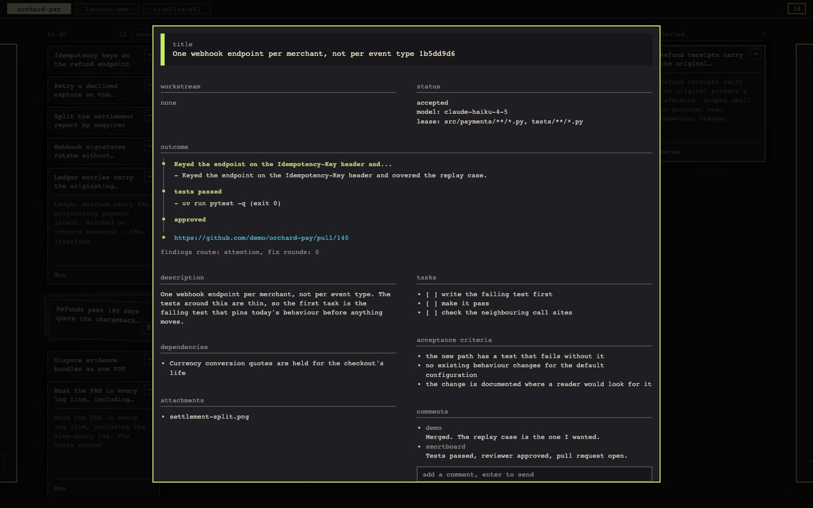

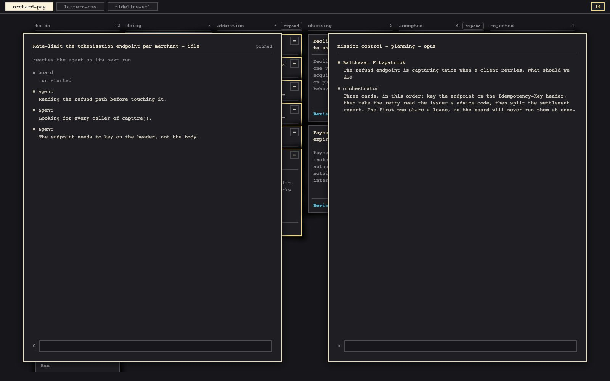

<sub>The board, an open card, and the two agent panels. Example content, from a demo database.</sub>

---

## Three rules

1. **The agent never decides it is finished.** Its claim that the tests pass counts for nothing. The
   board re-runs them offline. A separate read-only reviewer then reads the code itself for
   vulnerabilities, leaked credentials, bad practice and waste.
2. **The board never merges.** Every card ends at an open pull request or a stated reason it
   stopped, and merging is always done by a person.
3. **Every card runs sealed.** It gets its own throwaway container, a clone of its repo, a write
   lease and a command allowlist. If Docker isn't available, the card refuses to run rather than
   running outside a container.

## How a card runs

<picture>
  <source media="(prefers-color-scheme: light)" srcset="docs/images/art-lifecycle-light.png">
  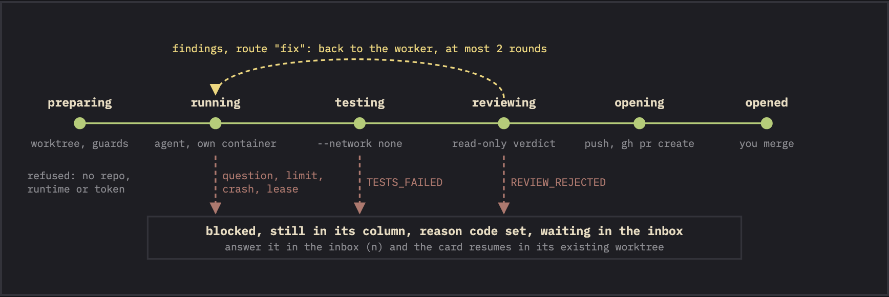
</picture>

| Phase | What happens |
|---|---|
| **preparing** | A worktree and branch per card. A resumed card reuses its worktree and commits. A card with dependencies is cut from a fresh fetch of the base branch. |
| **running** | `claude -p` streams JSON both ways in a named container. The token is the first stdin line, the brief follows, and stdin stays open for live notes. Every line becomes an event. |
| **testing** | The repo's own test command runs in the repo's image with no network. |
| **reviewing** | A second agent with Read, Grep and Glob only reviews the diff in its surrounding code and answers four questions: vulnerabilities (injection, path traversal, unchecked input), leaked credentials, best practices (the project's conventions and the language's), and efficiency. It never sees the test results and doesn't judge the criteria; the test gate does that. A leaked credential at any severity, any high or critical finding, or no usable verdict blocks the card. |
| **opening** | The board pushes the branch and runs `gh pr create`. A re-run of a card whose pull request is already open pushes to that one instead, never forced. Its `gh` wrapper allows four subcommands - `pr create`, `list`, `view` and `close` - and merge isn't one of them. |

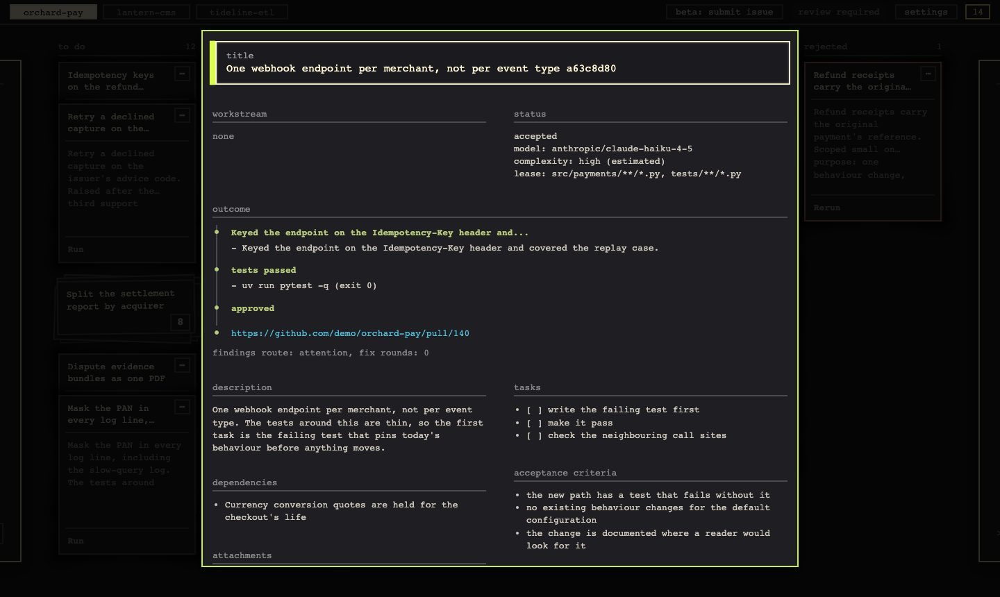

## Concepts

| | |
|---|---|
| **Board** | A named set of cards and repos. `1`-`9` jump between boards. |
| **Card** | One unit of work: a title, a description, acceptance criteria, tasks, dependencies, a lease, and optionally a model. |
| **Repo** | Where cards work: a path, a default branch, a test command, an optional lint command and an optional image. |
| **Lease** | The path globs a card may Edit or Write, set with `PATCH /api/cards/<id>` and `{"leases": [...]}`. An empty lease allows no writes at all, so the board refuses to run a card without one. |
| **Worktree** | One git worktree and branch per card. The container works on a clone, and its commits are fetched back. |
| **Attempt** | One run of a card, from its `lifecycle_started` event to where it stopped. Cost, replay and the resume briefing all work per attempt. |
| **Status** | Five columns: todo, doing, checking, accepted, rejected. There is no "blocked" column. |
| **Reason code** | Why a card waits on you, recorded alongside its status: `AGENT_QUESTION`, `TESTS_FAILED`, `REVIEW_REJECTED`, `LEASE_CONFLICT`, `USAGE_LIMIT`, `CRASH`, `DEPENDENCY_REJECTED`. |
| **Findings route** | Where reviewer findings go: back to the worker (`fix`), or to you (`attention`, the default). |
| **Decision** | `y` accepts a card and keeps its branch for the pull request. `x` rejects it and deletes the branch. Both can be reversed. |
| **Roles** | The **orchestrator** plans cards and has no tools. The **worker** works a card. The **reviewer** checks the worker's code for vulnerabilities, leaked credentials, bad practice and waste. Each role has its own prompt and model. |
| **Note** | A message to a running agent, delivered at its next step with a fixed marker it is taught to trust. Any other text claiming authority is treated as a prompt injection. |
| **Resume briefing** | When a card runs again, its brief summarises the last attempt: how it ended, gate verdicts, findings, files touched, and commands run or refused. |
| **Event log** | Every stream line, gate, decision and note, append-only. Cost, replay, the roster and the briefing are all projections of it. |

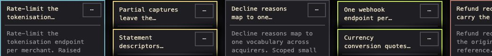

A card's state shows as its edge, not a fill: **blue** means an agent is working it, **vanilla**
with a stepped glow means it needs you, **lichen** means accepted and **red** means rejected. The
working blue is cold on purpose, and lichen and red stay distinguishable, so no pair collapses
under red-green colour blindness.

## Features

<table>
<tr>
<td width="50%" valign="top">
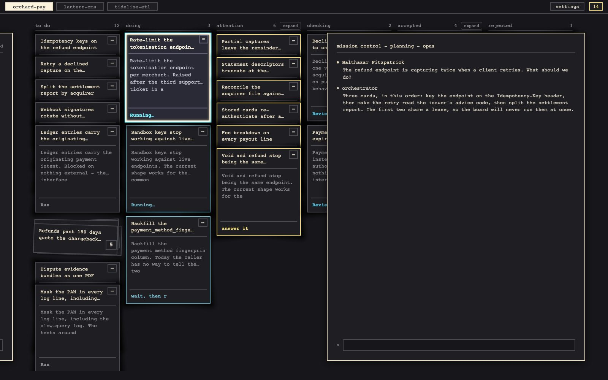<br>
<b>Mission control</b> <code>.</code><br>
Chat with the board's orchestrator. It answers with a plan and cards, each with a proposed model, and
it sees what each model has cost and passed on this board. Both drawers open without taking focus,
so the key that opened one closes it: <code>/</code> types into it, <code>Esc</code> hands focus back.
</td>
<td width="50%" valign="top">
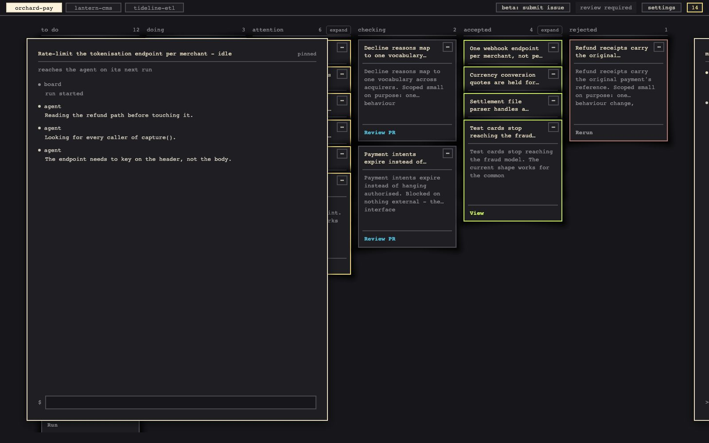<br>
<b>Workforce</b> <code>,</code><br>
A terminal with a card's agent: its narration and the board's gate lines. It is <b>pinned</b> to the
card you're on; with none focused it is a <b>mall cam</b>, rotating through every working card. A
note sent here reaches a running agent at its next step.
</td>
</tr>
<tr>
<td width="50%" valign="top">
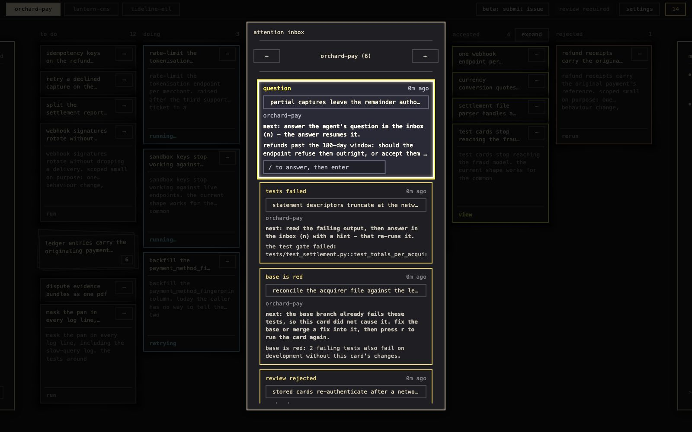<br>
<b>Attention inbox</b> <code>n</code><br>
Every card waiting on you, across every board, oldest first. An answer resumes the card in its own
worktree. Rows an answer can't help say where to act instead.
</td>
<td width="50%" valign="top">
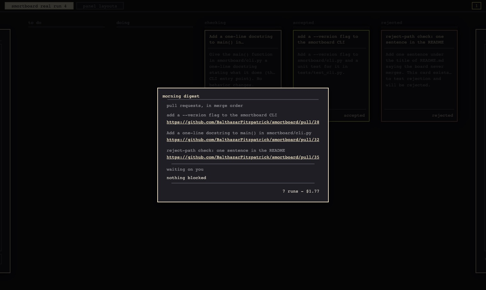<br>
<b>Run the board</b> <code>w</code> · <b>digest</b> <code>d</code><br>
Bounded parallel runs, two at a time by default. A card starts only once its dependencies' pull
requests are merged, and two cards whose leases may overlap never run at once. The board redraws as
runs start and finish, whoever started them.
</td>
</tr>
<tr>
<td width="50%" valign="top">
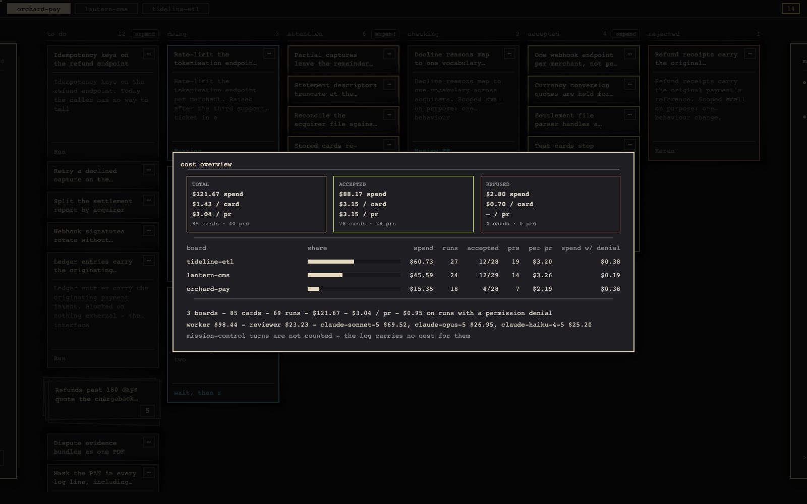<br>
<b>Cost per board</b> <code>c</code><br>
One row per board: its share of all spend, runs, accepted cards, pull requests, cost per pull
request, and money spent on runs that hit a refusal. Worker vs reviewer and spend by model sit in
the totals.
</td>
<td width="50%" valign="top">
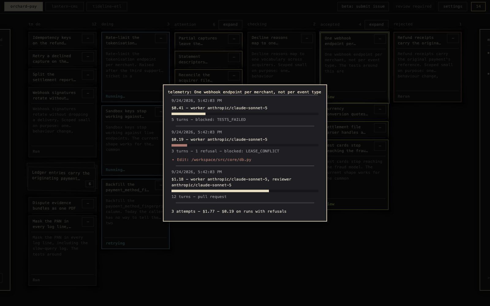<br>
<b>Card cost</b> <code>i</code><br>
Every attempt: cost, turns, fix rounds, refusals, and the model that did the work for each role.
</td>
</tr>
<tr>
<td width="50%" valign="top">
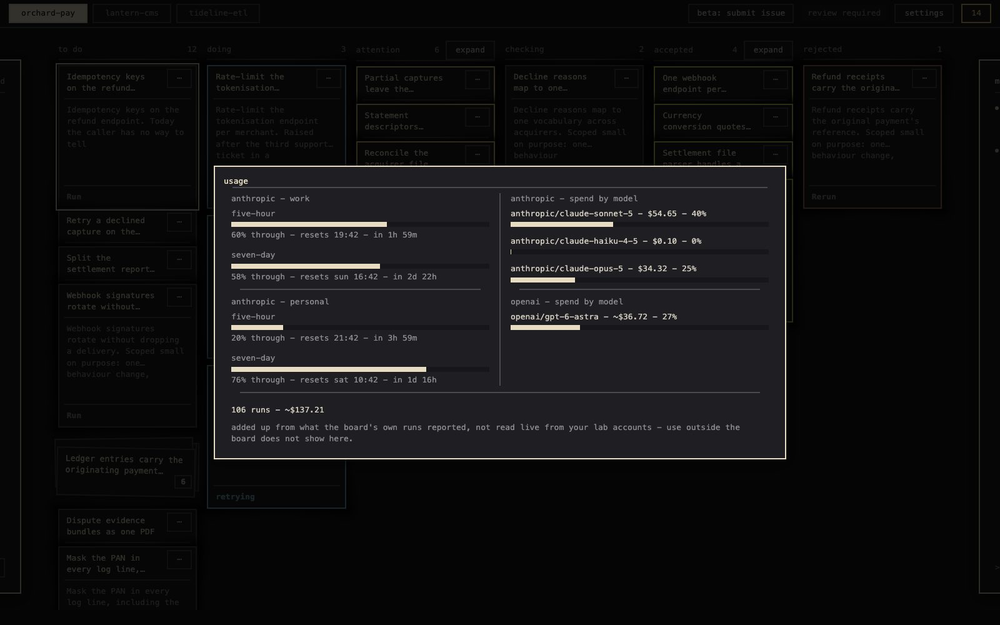<br>
<b>Usage</b> <code>u</code><br>
Rate-limit windows and spend per model. Where the stream reports only a reset time, a window shows
how far through it you are - as time, never as usage. A usage limit pauses new runs until its window
resets.
</td>
<td width="50%" valign="top">
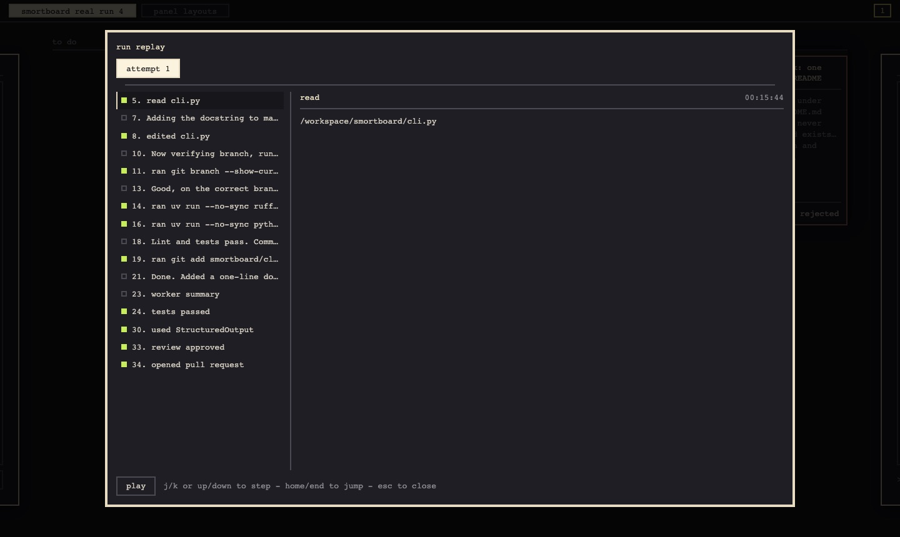<br>
<b>Replay</b> <code>t</code><br>
Step through a run: reads, edits as diffs, commands, refused calls, gates, verdicts. Any attempt.
</td>
</tr>
</table>

**Live steering.** A note sent to a running agent is written to its stdin with a fixed marker and
reaches it between two tool calls, in the same run. The worker is told to trust only that marker and
to treat any other text claiming authority as a prompt injection. A real run:

<picture>
  <source media="(prefers-color-scheme: light)" srcset="docs/images/art-steering-light.png">
  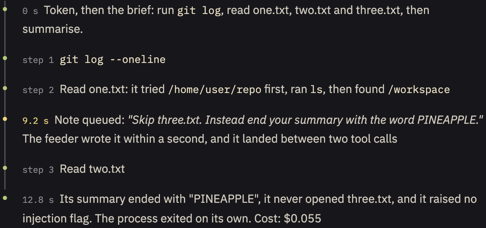
</picture>

**Stop** `k` asks once, then removes a running card's container. The card keeps its worktree and
commits, and nothing after the worker runs. **Prompts** `p` edits the three role prompts; every save
is a new version. **Model** `m` cycles a card through board default, haiku, sonnet and opus.

**Pre-flight checklist** `h` — what has to be true before a card can run, and the exact fix for
whatever isn't: docker, the card image, the card token file, `gh`, `git`, and, for every repo
registered on any board, its path, branches, `origin` remote, whether `gh` can see it on GitHub,
its test command, and its image. Each row that isn't ready shows the command to fix it, in the
board's monospace so it can be copied straight into a terminal - including telling you when the
matching GitHub repo hasn't been created yet. A summary line at the top says how many of the checks
are ready; re-check without leaving the panel.

## Architecture

<picture>
  <source media="(prefers-color-scheme: light)" srcset="docs/images/art-architecture-light.png">
  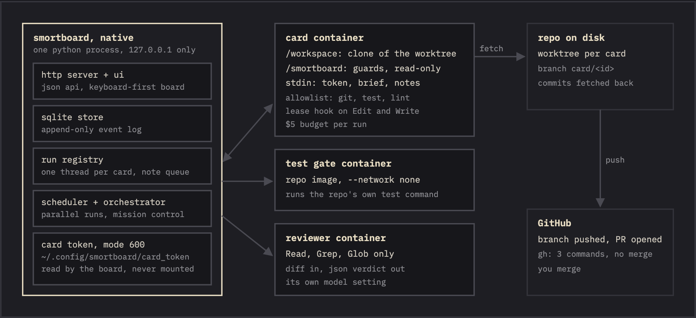
</picture>

The board is a plain Python process: a stdlib HTTP server, SQLite and plain JavaScript on
[smortui](https://github.com/BalthazarFitzpatrick/smortui). Only the agents are contained, because
a containerised board would need the Docker socket, which amounts to root on the host. Card runs,
orchestrator turns and scheduler ticks each open their own SQLite connection on their own thread.

## Security

- **Local only.** The API has no authentication, so the board binds `127.0.0.1`. `--host` is an
  explicit opt-in; only use it behind something that authenticates.
- **The token travels on stdin.** It is a model-only `claude setup-token`. It is never an env var or
  a mounted file, and never visible to `docker inspect`. On the host it lives in a mode-600 file.
- **Guards are read-only.** A lease hook covers Edit and Write. A bash guard allows only git plus the
  repo's test and lint commands. Both are mounted read-only outside the working tree, so the agent
  can neither edit nor commit them.
- **Proof comes from outside the agent.** The tests re-run offline, and the reviewer can only read.
  Only a note carrying the fixed marker counts as the operator.
- **An expired or revoked token** (HTTP 401) refuses the card with the steps to renew it.
- **No merge path exists** in the code.

## Cost

- Workers and the reviewer default to sonnet, and the orchestrator to opus. A card's model overrides
  the board setting, which overrides the default. The reviewer has its own setting, so a cheap worker
  never means a cheap review.
- Each worker run is capped at $5 (`--max-budget-usd`). Findings go back to the worker at most twice,
  and by default they go to you instead.
- A card's pull request states what the tests and the reviewer said, and what the branch cost: every
  run on the card summed - worker, reviewer, fix rounds and earlier attempts.
- Costs come from each run's own stream (`total_cost_usd`, `modelUsage`), per turn, summed per
  session. The model credited is the one with the highest spend, not the small helper Claude Code
  bills alongside it:

<picture>
  <source media="(prefers-color-scheme: light)" srcset="docs/images/art-cost-credit-light.png">
  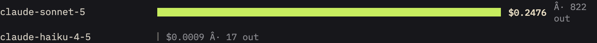
</picture>

## Keys

Bindings follow the physical key, so a non-US layout doesn't move them. `s` shows them in the app.

| Cards | | Panels | |
|---|---|---|---|
| arrows | move | `n` | attention inbox |
| `Space` `Enter` | open / close | `d` | morning digest |
| `Esc` | one level back | `c` | cost per board |
| `r` | run | `i` | card cost |
| `k` | stop | `u` | usage |
| `y` `x` | accept / reject | `a` | agent roster |
| `m` | model | `p` | prompts |
| `t` | replay | `.` | mission control |
| `w` | run the board | `,` | workforce |
| `g` | kanban / workstreams | `s` | shortcuts |
| `/` | type: the open card's comment, or the open chat | `b` | boards and repos |
| | | `h` | pre-flight checklist |
| | | `1`-`9` | jump to a board |

## Setup

```bash
git clone https://github.com/BalthazarFitzpatrick/smortboard && cd smortboard
uv sync
uv run smortboard            # http://127.0.0.1:8000/ui/index.html
```

Or run the board without a checkout: `uvx --from git+https://github.com/BalthazarFitzpatrick/smortboard smortboard`.
You still need the clone once, to build the Docker images below.

### Before a card can run

The board runs with nothing else installed. Running cards needs three more things.

**1. Docker, running.** Docker Desktop on macOS and Windows, Docker Engine on Linux.

**2. The card image, built once from the clone.** It holds the `claude` CLI, git and uv - no
credentials, no code.

```bash
docker build -f docker/card.Dockerfile -t smortboard-card:latest .
```

**3. A card token.** A model-only token, separate from your own login, kept in a file only you can
read. Generate it:

```bash
claude setup-token
```

It opens the browser, and once you approve, it prints the token in the terminal. That is the only
copy: nothing saves it, and nothing puts it on the clipboard for you. **Select it and copy it
yourself**, then store it with option A or option B below. The file goes here:

| OS | Token file |
|---|---|
| macOS, Linux | `~/.config/smortboard/card_token` (`$XDG_CONFIG_HOME/smortboard/card_token` if that is set) |
| Windows | `%APPDATA%\smortboard\card_token` |

A full token is 108 bytes. The board strips surrounding whitespace, so a trailing newline is fine.

**Option A - straight from the clipboard.**

macOS:

```bash
mkdir -p ~/.config/smortboard
# umask 077 creates the file as mode 600; tr strips the newline and any line-wrap breaks
(umask 077; pbpaste | tr -d '\r\n ' > ~/.config/smortboard/card_token)
wc -c < ~/.config/smortboard/card_token      # 108
```

Linux: the same, with `wl-paste` (Wayland) or `xclip -selection clipboard -o` (X11) in place of
`pbpaste`.

Windows (PowerShell):

```powershell
New-Item -ItemType Directory -Force "$env:APPDATA\smortboard" | Out-Null
(Get-Clipboard -Raw) -replace '\s', '' |
  Set-Content -NoNewline -Encoding ascii "$env:APPDATA\smortboard\card_token"
(Get-Item "$env:APPDATA\smortboard\card_token").Length      # 108
```

**Option B - create the file first, then paste into it.**

macOS, Linux:

```bash
mkdir -p ~/.config/smortboard
touch ~/.config/smortboard/card_token
chmod 600 ~/.config/smortboard/card_token    # lock it before the token goes in
nano ~/.config/smortboard/card_token         # paste, save, quit - any editor works
wc -c < ~/.config/smortboard/card_token      # 108, or 109 with the editor's newline
```

Windows (PowerShell):

```powershell
New-Item -ItemType Directory -Force "$env:APPDATA\smortboard" | Out-Null
New-Item -ItemType File "$env:APPDATA\smortboard\card_token" | Out-Null
notepad "$env:APPDATA\smortboard\card_token"                # paste, save
```

Windows has no `chmod 600`: a file under your user profile is already restricted to your account.

**Other places the board looks.** `SMORTBOARD_CARD_TOKEN_PATH` points it at a file anywhere else.
With no file, it falls back to the OS credential store - Keychain on macOS, Credential Manager on
Windows, Secret Service on Linux - under service `smortboard-card-token`, account `smortboard`. The
file comes first because macOS prompts on every Keychain read.

**This is not where Claude keeps its own login.** `claude setup-token` stores nothing, so the card
token lives only where you put it. Your own `/login` credential is separate, and Claude Code keeps
it here:

| OS | Claude Code's own login |
|---|---|
| macOS | the macOS Keychain (`~/.claude/.credentials.json`, mode 600, if the Keychain refuses the write) |
| Linux | `~/.claude/.credentials.json`, mode 600 |
| Windows | `%USERPROFILE%\.claude\.credentials.json`, restricted by your user profile |

The board never reads that login and a card never sees it. Do not copy a token out of it - the
card token is the narrower, model-only one.

### A board and its repo

Press `b` to create a board and register a repo on it: its path, default branch and test command.
The repo itself has to exist on GitHub and have its default branch pushed already - smortboard only
registers it, it doesn't create it. Its image must already contain its toolchain, because the test
gate is offline. smortboard's own image is `docker/repo.Dockerfile`.

The test command is the gate, so give it everything your CI checks - for a Python repo, something
like `uv run --no-sync ruff format --check --extend-exclude .claude . && uv run --no-sync pytest -q`.
A gate that runs less than CI lets a card open a pull request that fails CI. `--extend-exclude
.claude` skips the board's own hooks inside the card's worktree.

Docker Desktop keeps the memory its containers have used until it restarts, so give it a limit in
Settings → Resources. A repo image with a large toolchain (torch, say) grows it quickly; lower
`max_parallel` if a small limit is tight.

| Flag | Env | Default |
|---|---|---|
| `--port` | `SMORTBOARD_PORT` | `8000` |
| `--host` | `SMORTBOARD_HOST` | `127.0.0.1` |
| `--db` | `SMORTBOARD_DB` | user data dir |
| `--no-browser` | | opens a tab |
| | `SMORTBOARD_CARD_IMAGE` | `smortboard-card:latest` |
| | `SMORTBOARD_CARD_TOKEN_PATH` | `~/.config/smortboard/card_token` |
| | `SMORTBOARD_OPERATOR_NAME` | your `git config user.name` |

The operator name is who the board shows on your own notes and chat lines, and who the agents are
told to trust: a live note starts `Note from <name>, via the board:`.

Board-wide settings are set with `PATCH /api/settings`: `findings_route`, `orchestrator_model`,
`worker_model`, `reviewer_model`, `max_parallel`, and `resume_briefing` (`"off"` disables it).

## Testing the alpha

Everyone runs their own board on their own machine; nothing is shared.

1. **Install and start** the board as above, then open it in the browser.
2. **Press `h`** for the pre-flight checklist: Docker, the card image, the token, `gh`, and every
   repo you register. Fix what it lists; each line says how.
3. **Create the GitHub repo** you want cards to work on, clone it, and push its default branch. The
   board opens pull requests there, so it has to exist on GitHub first.
4. **Press `b`** to create a board and register that repo: its path, default branch, test command
   and image. Press `h` again until everything is green.
5. **Press `.`** and describe some work. Mission control proposes cards; focus one and press `r`.
6. **Something wrong?** [Open a bug report](https://github.com/BalthazarFitzpatrick/smortboard/issues/new?template=bug.yml).
   Paste what `h` shows and, if a card misbehaved, a screenshot of its replay (`t`). Never paste
   your token.

## Limits

- A stop that lands while the test gate is running waits for the gate to finish.
- Mission-control turns carry no cost in the log, so they're not counted.
- The HTTP server handles one request at a time. That's fine for one person on one machine.
- A card's pull request lists its tasks as checkboxes, and nothing ticks them during a run.
- The `b` panel edits a repo's test command and image; its lint command and default branch are set
  when it's registered.
- Windows code paths exist but have never been run.

## Development

```bash
uv run pytest
for f in tests/js/*.mjs; do node "$f"; done
uv run ruff check . && uv run ruff format --check .
```

Neither suite calls a model or Docker. `docs/PLAN.md` has the plan and the containment reasoning,
`docs/PHASE1-CONTRACTS.md` the schema and API, `docs/PROMPTS.md` the prompt layering, and
`docs/spikes/` what was proven before it was built on.

## License

[MIT](LICENSE). Use it, change it, ship it; keep the copyright notice.
