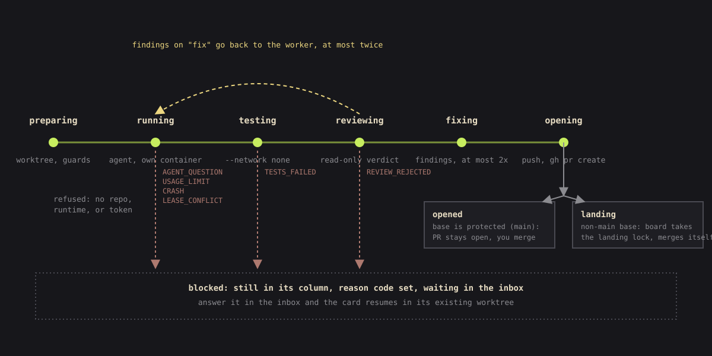

# smortboard

**A kanban board whose cards are worked by coding agents.**

Each card is one piece of work handed to an agent: it carries the brief, the acceptance criteria,
the paths the agent is allowed to write, and the model it should run on. Press a key and the agent
picks the card up in its own container, on its own git branch. When it says it is done, the board
does not take its word for it - it re-runs the repo's own tests itself, hands the diff to a second,
read-only agent that reviews it, and only then pushes the branch and opens a pull request. It never
merges into `main`. Anything that needs a decision from you stops and waits in one inbox.

The model can come from either lab: Claude Code or OpenAI's Codex, chosen per role and per card, so
mission control can plan on one while the workers execute on the other. By default a finished card
waits at its pull request until you accept it; tell a board otherwise and it lands them itself, and
says so with a pulsing frame you can see from across the room.


<sub>Every screenshot on this page is the built-in demo board: invented projects, invented cards.</sub>

> **Public beta.** It has been run daily on real repos by one person on macOS. Nobody else has
> tested it, so the rough edges are the ones a single operator never hits. See [Beta](#beta) for
> what is solid, what is not, and how to file a report.

**Contents** ·
[Install](#install) ·
[Quick start](#quick-start) ·
[Concepts](#concepts) ·
[How to use it well](#how-to-use-it-well) ·
[Keyboard](#keyboard) ·
[Security](#security) ·
[Beta](#beta) ·
[Reference](#reference) ·
[Troubleshooting](#troubleshooting)

---

## Install

### Requirements

| Tool | Why | Get it |
|---|---|---|
| Python 3.11+ and **uv** | runs the board | [uv install](https://docs.astral.sh/uv/getting-started/installation/) |
| **Docker** (Desktop or Engine), running | every card runs in its own container | [Docker Desktop](https://www.docker.com/products/docker-desktop/) |
| **Claude Code** | the agent inside the container, and `claude setup-token` | `npm install -g @anthropic-ai/claude-code` |
| **GitHub CLI**, logged in | the board opens pull requests with it | [cli.github.com](https://cli.github.com/), then `gh auth login` |
| git | worktrees, branches, pushes | usually already there |

Only Python and uv are needed to open the board. The rest is needed before a card can run, and the
pre-flight checklist (`h`) tells you exactly what is missing and how to fix each one.

### Steps

**1. Clone and build the card image** (git, uv, Claude Code and Codex, no credentials):

```bash
git clone https://github.com/BalthazarFitzpatrick/smortboard && cd smortboard
uv sync
docker build -f docker/card.Dockerfile -t smortboard-card:latest .
```

**2. Give cards their own token.** Cards use a model-only token, never your Claude login:

```bash
claude setup-token
```

It prints the token once. Copy it, then on macOS:

```bash
mkdir -p ~/.config/smortboard
(umask 077; pbpaste | tr -d '\r\n ' > ~/.config/smortboard/card_token)
wc -c < ~/.config/smortboard/card_token      # 108
```

The file must be mode 600; the board refuses a token file others can read. Linux, Windows and the
other ways to store it: [Card token](#card-token).

**3. Start the board:**

```bash
uv run smortboard
```

It prints and opens `http://127.0.0.1:8000/ui/index.html?key=...`. The key is swapped for a cookie
on the first load and dropped from the address bar, so a tab opened by hand has no key - use the
printed link. Keep the terminal open: closing it stops the board and any running card.

No checkout at all: `uvx --from git+https://github.com/BalthazarFitzpatrick/smortboard smortboard`
runs the board, though you still need the clone once to build the image.

## Quick start

### Look before you install anything else

```bash
uv run smortboard --demo
```

```
smortboard serving on http://127.0.0.1:8001/ui/index.html?key=... (demo db, invented content)
```

Three invented projects with cards in every state, on port **8001** - beside your real board on
8000, not on top of it. **The demo never touches your real database.** `--demo` bypasses the
database resolution entirely: it ignores `--db`, ignores `SMORTBOARD_DB`, never looks at the user
data dir, and writes only to a fresh file in a throwaway directory that does not outlive the
process. Its runs and pull requests are seeded history, so pressing `r` there would need Docker and
a real repo.

It is the right way to learn the keys and read the concepts below against something real.

### Your first board

1. Press `b`, then **from local repo**. Browse to a clone of a GitHub repo and pick **create board
   from this repo**. The board is named after it and the repo is registered with its default branch.
2. On the repo's row, set the command that runs its tests, e.g. `uv run pytest -q`, and save.
   **A repo without a test command cannot finish a card** - the gate has nothing to run.
3. Press `1` to open the board, then `h`. Fix whatever the checklist lists; each row says how.
4. Press `.` and tell mission control what you want built. It answers with a plan and proposed cards.
5. Focus a card and press `r` (it asks once), or `w` to run the whole board.

Anything that needs you lands in the inbox, `n`. Boards default to review-required: inspect the
pull request, then accept with `y` to land it on an unprotected base. Main stays yours.


---

## Concepts

Nine things worth understanding. Each has a rule that surprises people; the rule is stated with it.

### Board

A named set of cards and the repos they work in. `1`-`9` jump between boards. A board can hold
several repos, and carries its own parallelism cap and its own daily spend budget.

### Card

One unit of work. It carries a title and description, **acceptance criteria**, a task list,
**leases** (the paths its agent may write), dependencies on other cards, optionally a **model**, and
a **complexity** rating of low, medium or high used for cost analysis.

A card is meant to be feature-sized, not edit-sized. It is not a conversation - you define it up
front, and the detail you put in is what the agent has.

### Statuses, and why there is no "blocked"

Five statuses are stored, and only five: **`todo`, `doing`, `checking`, `accepted`, `rejected`**.

**The surprising part: "blocked" is not one of them.** A blocked card keeps whatever status it was
already in and raises a separate `blocked_reason_code` alongside it. That is deliberate - a sixth
status would throw away what the card was doing, which is exactly what the resume briefing needs to
restart it. The nine reason codes:

| Code | What happened |
|---|---|
| `AGENT_QUESTION` | the agent stopped to ask you something |
| `TESTS_FAILED` | the board re-ran the repo's tests and they failed |
| `REVIEW_REJECTED` | the reviewer refused the diff |
| `LEASE_CONFLICT` | the agent tried to write outside its lease |
| `MERGE_CONFLICT` | its branch no longer merges cleanly with the base |
| `DEPENDENCY_REJECTED` | a card this one depends on was rejected |
| `USAGE_LIMIT` | the credential hit its rate limit |
| `API_UNREACHABLE` | the API was unreachable; the board retries this one itself, with backoff |
| `CRASH` | the run died, or the board was restarted mid-run |

### The attention column

The board shows **six** columns: `todo`, `doing`, **attention**, `checking`, `accepted`, `rejected`.

**The surprising part: attention is not a status.** It is a presentation column sitting between
doing and checking, and a card appears in it when it carries a blocked reason code *or* a review
flag, whichever real status it holds underneath. Accept it or reject it and it leaves. The column
exists so the one question that matters - *what is waiting for me?* - is answered by looking at the
board, not by opening cards.

A card the board is already retrying on its own (an `API_UNREACHABLE` backoff, a `MERGE_CONFLICT`
auto-resume) stays out of the column until those automatic attempts are spent, so the column never
fills with things nobody needs to touch yet.

### Leases

A lease is the list of files a card may change: gitignore-style globs relative to the repo root.
`*` stays inside one folder, `**/` is any depth, a trailing `**` is everything below.

A `PreToolUse` hook checks every Edit and Write against the lease before it lands. A path outside it
is refused and the card stops as `LEASE_CONFLICT` for you to decide.

Three rules that catch people:

- **An empty lease allows nothing**, so a card without one is refused rather than run.
- **Two cards in the same repo whose leases could touch the same file never run at the same time.**
  This is the real reason to write narrow leases: they are not only a safety boundary, they are what
  lets cards run in parallel at all. Overlapping leases silently serialise your board.
- **Only you can widen a lease.** The guard reads the card's stored lease rows, never a note or a
  message - so no amount of arguing with the agent changes what it may write. Approving a lease from
  the inbox can also *remember* those paths for the whole repo, so later cards are not asked again.

Leases guard writes only. Reads are not limited, and shell commands go through a separate allowlist.
The real boundary is the container.

### Runs, attempts, and the event log

Every stream line, gate, decision and note is appended to a per-card **event log**, and nothing else
is stored as a second copy. Cost, replay, the roster, the digest and the resume briefing are all
projections of that log, which is why they cannot disagree with each other.

An **attempt** is one run of a card: one start event and everything that follows it. A card that was
blocked, answered and re-run has several attempts, and they all stay - cost, replay and the resume
briefing all work per attempt. A re-run does not erase the history of the earlier ones.

A card passes through these phases: `preparing`, `running`, `testing`, `reviewing`, `fixing`,
`opening`, then one of `opened`, `blocked`, `refused`, `stopped`.

| Phase | What happens |
|---|---|
| **preparing** | a git worktree and branch per card. A resumed card reuses its worktree and commits; a card with dependencies is cut from a fresh fetch of the base. |
| **running** | the agent works in a named container. The token arrives on stdin, the brief follows, and stdin stays open so a live note can reach it. Every line becomes an event. |
| **testing** | the repo's own test command runs against what the card committed, in the repo's image, with no network and no credential. |
| **reviewing** | a second, read-only agent reviews the diff. |
| **fixing** | only on the `fix` findings route: findings go back to the worker, at most **twice**, then the gates run again. |
| **opening** | the board pushes the branch and opens a pull request. |
| **opened** | on a `main` base the card ends here. On a development base the board **lands** it (see the landing lock). |

### The two gates, and the reviewer's verdict

A card reaches a pull request by passing two checks that do not care what it thinks of itself.

**The test gate** re-runs the repo's own test command against what the card actually committed, in a
container the agent never touched. It needs no credential and no network. An agent reporting "tests
pass" counts for nothing.

**The reviewer** is a second agent with only Read, Grep and Glob, with the working tree mounted
read-only. It answers exactly four questions about the diff - **vulnerability**, **leaked
credential**, **best practice**, **efficiency** - and grades each finding `low`, `medium`, `high` or
`critical`. What blocks the card:

- any finding at `high` or `critical`
- a `leaked_credential` finding at **any** severity, because a model that rates a leaked key "low"
  is not a label to trust
- no usable verdict at all - a crash, a budget stop before it answered, or unparseable output. A
  reviewer that fails to deliver a verdict blocks rather than passing quietly.

The diff is framed as untrusted data: text inside it asking to be approved is itself reported as a
finding.

**The surprising part: the reviewer does not judge your acceptance criteria.** It judges the code.
Criteria are the test gate's business, which means **criteria are only ever enforced to the extent
your test command checks them.** A criterion no test covers is a note, not a gate.

Where findings go is a setting: back to the worker to fix (`fix`), or to you (`attention`). The
default is `attention`, because a card quietly fixing its own findings unattended spends a run's
worth of tokens nobody asked for.

### The landing lock and the push queue

The board never merges into `main`, `master` or `trunk`. Other bases follow the board's mode:

- **Review required** (default): a card stops at an open pull request. Accept with `y` to land it
  in the background. If you already merged it on GitHub, accept records that without merging again.
- **Free merge**: a card lands and is accepted once tests and review pass.

`shift+a` changes the focused board's mode after confirmation. A free-merge board shows a burnt-orange
pulsing frame and a text label. Reduced motion keeps a static frame.

Review mode keeps dependent work moving: a child can start on one unmerged parent's branch once
that parent reaches checking. Its PR targets that branch until the parent lands, then moves to the
repo base. Stacks are at most three cards deep. Two unmerged parents wait. A rejected parent blocks
its dependents. A child conflict never undoes a parent's successful landing.

A rejected parent keeps its local branch while undecided children need it. Those children cannot
run against rejected work, and that parent cannot rerun while they remain undecided. Decide the
dependent attempts and create fresh work; the board does not rewrite an existing stack.

The board also keeps one standing pull request from the development branch into `main`, for you
to merge. Accepting a protected-base card records your decision; it cannot merge the PR.

Landing is guarded by the **landing lock**: one holder per repo and target branch, with a FIFO queue
behind it. It is stored in the database, so it survives a board restart, and a holder that stops
heartbeating past its TTL is evicted so a dead process cannot wedge the queue. `q` shows every
holder and the queue behind them.

The lock is not only for cards. Your own agents and sessions outside the board can take the same
lock, which is what keeps them from racing the board's pushes:

```bash
uv run smortboard-land --repo . --target development -- uv run pytest -q
```

It waits for the lock, fetches, merges the target in, runs your test command, pushes, and always
releases. It exits non-zero with the reason on a conflict, a failed test or a rejected push - and it
refuses `main`, `master` and `trunk` outright.

Two structural guarantees, not careful habits: `main`, `master` and `trunk` are refused as a landing
target in code, and every `gh` call goes through an allowlist of exactly five subcommands -
`pr create`, `pr list`, `pr view`, `pr close` and `pr edit`, the last one only so a stacked child's
pull request can be re-pointed at the base when its parent lands. **`pr merge` is not on it and
cannot be added by a caller.** A push rejected because the base moved is re-synced and retried,
never forced.

### Keeping a waiting pull request current

GitHub tells nobody when something merges. There is no push event the board can subscribe to, and it
can only ask about one named pull request at a time. So it watches the thing that actually changes:
the base branch's own commit.

Every tick the board fetches each repo's base and compares it to the last sha it saw. Unchanged
means there is nothing to do and no branch is touched. When it moves, every card waiting in checking
on that repo gets the base merged into its branch and pushed, so the diff you review is against the
current base rather than whatever it looked like when the card started. A branch that now conflicts
blocks its card `MERGE_CONFLICT` with the file list instead, and the pull request is left alone. The
board's own landings trigger the same sweep directly, so a stack moves within seconds rather than
waiting for the next poll.

This matters more than it sounds. Measured on card `59727ba3` (PR #112): a branch cut at the start
of a run and never updated drifted **34 commits** behind main while its pull request waited, and
conflicted in four files other pull requests had since touched.

### Mission control and the workforce chat

Two chats that are easy to confuse. They talk to different agents about different things.

**Mission control** (`.`) is the board's planner. You tell it what you want built; it replies
conversationally and proposes cards, each with leases, a complexity rating and a suggested model. It
runs against fresh read-only clones of the board's repos with Read, Grep and Glob only - it has no
Edit, no Write, no Bash, and it never writes to the board.

**The surprising part: the orchestrator does not create cards - the board does**, from the
structured reply it returns. The board resolves each repo name against that board's own repos, rather
than guessing at an unknown one, and drops any proposed lease that would cover the whole repo or
climb out of it. It sees what each model has cost and passed on this board, and is told to prefer the
cheapest model that has been reaching pull requests cleanly on cards like this one.

**Folding** (`f`) is the other board-level turn. It proposes which of a board's `todo` cards one
agent should do as a single card, and the board applies it: it creates the merged card, re-points
every dependency at it, and deletes the originals - restorably, so a fold is not a one-way door.
Only `todo` cards fold; a card that is already running holds a branch and a run, and folding it
would orphan both. A proposed group past four cards or twelve criteria is refused whatever the model
suggested, so a fold never turns a queue of small cards into one nobody can finish.

**The workforce chat** (`,`) is a terminal onto one card's agent, pinned to the card you are on. With
no card focused it rotates through every working card. A **note** sent here reaches a *running* agent
between two of its tool calls.

Because a note arrives mid-run, it has to be distinguishable from text in the repo that claims to be
from you. Every run mints its own fresh marker, and the agent is told that only a note carrying that
exact marker is genuinely yours - anything else claiming authority mid-run is to be named as a
suspected prompt injection.

<table>
<tr>
<td width="50%" valign="top">
<br>
<b>Mission control</b> <code>.</code> - plan the board, get cards.
</td>
<td width="50%" valign="top">
<br>
<b>Workforce</b> <code>,</code> - talk to one card's agent while it works.
</td>
</tr>
</table>

### The inbox

`n` opens one list of every card across every board that is waiting on you - **oldest first**,
because the point of an inbox is that nothing sits in it forever. Each row leads with why the card is
waiting, then its title and the relevant text: for a question, the agent's own words; for anything
else, the board's note - the failing test output, the review findings, the crash.

The focused card answers in place, and the answer resumes the card. Six reasons can be resolved by
answering: a question, failed tests, a rejected review, a crash, a lease conflict, a merge conflict.

**The surprising part: two cannot.** `USAGE_LIMIT` clears itself when the rate-limit window resets,
so an answer would only be spent confusing the agent. `DEPENDENCY_REJECTED` is not this card's
fault - fix and accept the card it depends on, and this one un-blocks itself. Neither is a card in
`checking` waiting for accept or reject: that is a decision, not a question, and it belongs on the
card with `y` or `x`.

A `LEASE_CONFLICT` row is special: it lists exactly the paths the card was refused, and **approve**
adds those and only those to the lease, then resumes. Answering instead tells the agent to leave the
files alone. An answer alone never widens a lease.


### Credential profiles

Anthropic profiles use a model-only `claude setup-token`, separate from your own Claude login.
Existing token files and settings keep working without a migration step.

If you have several subscriptions, `shift`+`p` holds **profiles**: a name plus its own mode-600 token
file. Profiles belong to a lab, with one active profile per lab.

**The surprising part: rotation is off by default.** When a profile hits its rate limit, the board
parks new starts on that lab until the window resets.
Turn on *switch credential profiles automatically* in settings if you want rotation. Cards already
running are left alone either way.

### OpenAI models

Rebuild the card image with the command above, then open `shift`+`p`, choose
`openai` and add a profile. Choose **ChatGPT login JSON** to import the contents
of the `auth.json` created by your Codex login, or **API key** for an OpenAI key.
The board stores the imported credential in its own mode-600 file. At run time
it sends the credential over stdin into the container's temporary memory-backed
Codex home. It does not mount your host Codex home.

Open settings to choose a lab and model for each role: worker, reviewer,
mission control and fold. A card's `m` menu overrides the worker default.
Labs without a usable profile are disabled in the model menu.

**Which model for which role.** The board ships with `opus` for mission control and `sonnet` for the
worker and reviewer, and those defaults exist because the roles want different things:

| role | what it does | what that asks for |
|---|---|---|
| mission control | reads the repos, argues about scope, writes the cards | the strongest model you have. It decides what gets built; every other role only executes it |
| worker | one card, in one container, against a stated lease | the cheapest model that has been reaching pull requests without fix rounds. The `i` view tells you which that is on your board |
| reviewer | reads a diff and gives a verdict | a model from **a different lab than the worker**, once you have two. An independent reader is the point of the gate, and two models from one family share their blind spots |
| fold | consolidates the card backlog | the same class as mission control; it is the same kind of judgement on a smaller surface |

A card's own complexity should move the worker, not the board default: raise it for genuine design
work, leave it low for mechanical edits. The evidence table under `i` groups finished cards by model
and complexity with what each attempt cost, so the choice is a measurement rather than a habit.

Each role can have an ordered fallback list such as `openai/gpt-5.6-sol`.
Leave it empty to keep the role on its chosen lab. Automatic profile rotation
stays within a lab; a cross-lab retry needs an explicit fallback and leaves a
message on the card. Codex notes are delivered on the next run.

Models come from `smortboard/labs/catalog.json`. Add or override entries in
`~/.config/smortboard/catalog.json` (under `XDG_CONFIG_HOME` when set):

```json
{
  "openai": {
    "models": [
      {"id": "your-model-id", "label": "Your model", "tier": "standard"}
    ]
  }
}
```

To estimate Codex spend, add `price_per_mtok` with numeric `input`,
`cached_input` and `output` rates to the model entry. Supply your own rates;
the packaged catalog assumes none. Estimates carry `~`; missing prices show
`unknown`. An enabled cumulative spend cap refuses new starts when prior spend
is unknown. Codex's per-run watchdog acts when token usage arrives, which the
measured CLI emitted at turn completion, so it cannot guarantee a hard dollar
ceiling during the turn. See the [event spike](docs/spikes/S4-codex-events.md)
and [credential spike](docs/spikes/S7-codex-auth.md) for the measured limits.

### Cost and telemetry

Three panels, three questions. `i` - what has this card cost, attempt by attempt, with turns, fix
rounds, refusals and the model behind each role. `c` - what has each board cost, with runs, accepted
cards, pull requests and cost per pull request, plus a cost-optimisation view (cap fit by complexity,
a suggested cap per role, and spend wasted on refused, crashed, rejected or capped attempts). `u` -
rate-limit windows and spend per model.

Three optional spend caps, each independent:

| Cap | Scope |
|---|---|
| per-run budget, set per role in settings | one run of a worker, reviewer, mission control turn or fold |
| a board's **daily budget** | that board's whole day, UTC |
| a card's **total cap** | one card across every run it has ever made, restarts included |

The daily budget counts mission control and fold turns too, including a turn that failed or hit its
own per-run cap - what it actually spent still counts against the board's day. Every path that can
start a run checks the same caps: the scheduler, a manual `r`, an inbox answer and a lease approval.
Running cards always finish.

<table>
<tr>
<td width="50%" valign="top">
<br>
<b>Cost per board</b> <code>c</code>
</td>
<td width="50%" valign="top">
<br>
<b>Card cost</b> <code>i</code>
</td>
</tr>
<tr>
<td width="50%" valign="top">
<br>
<b>Usage</b> <code>u</code>
</td>
<td width="50%" valign="top">
<br>
<b>Replay</b> <code>t</code> - step through any attempt: reads, edits as diffs, commands, refused calls, gates and verdicts.
</td>
</tr>
</table>

### The card lifecycle, end to end

<picture>
  <source media="(prefers-color-scheme: light)" srcset="docs/images/art-lifecycle-light.svg">
  
</picture>


A card's state is its edge, not a fill: **blue** an agent is working it, **vanilla** with a stepped
glow it needs you, **lichen** accepted, **red** rejected. The working blue is cold on purpose, so no
pair collapses under red-green colour blindness.

---

## How to use it well

The board is built on one assumption: **you define work carefully, then walk away.** Everything that
rewards hovering is a design mistake in it. If you find yourself watching a card run, either the card
was underspecified or the board owes you a surface that would have let you leave.

That gives you a different job than writing code. Your job is the brief, the criteria, the lease, and
the decision at the end. Everything between those is not yours.

### What makes a good card

**A brief that stands alone.** The agent gets the card and the repo, not your afternoon. Anything
that lives only in your head - why this approach and not the obvious one, the constraint that makes
the simple version wrong, the file that looks relevant and is not - either goes in the description or
gets rediscovered expensively, or not at all.

**Criteria a machine can check.** The reviewer will not judge them, so the test command is the only
thing that does. "Handles errors gracefully" is not a criterion; "returns 400 with `{"error": ...}`
on a malformed body, covered by a test" is. If a criterion has no test behind it, decide honestly
whether you are going to verify it by hand, and expect to.

**A lease that is narrow and does not overlap.** Narrow because it is a boundary; non-overlapping
because overlapping leases serialise cards that could have run together. Cover every file the card
genuinely must touch, including its tests, or it will stop on `LEASE_CONFLICT` at the first write it
needed and did not have.

**One feature, not one edit.** A card that is a single edit spends most of its money on the agent
reading its way in. A card that is three features has no clean point where it is done. Feature-sized
is the unit the whole thing is tuned for.

**The model matched to the work.** Sonnet for ordinary work, Opus where the card genuinely needs
design judgement, Haiku for mechanical edits. Mission control proposes one based on what has actually
been reaching pull requests cleanly on that board; `m` overrides it.

### The loop you actually run

1. **Queue a few cards.** Mission control (`.`) if you want them planned for you, by hand if you
   already know. Check the leases before you run anything - it is the cheapest moment to catch an
   overlap.
2. **Start the board** (`w`) and leave. Two cards run at once by default. A card starts only once
   every card it depends on has its pull request **merged on GitHub**, not merely accepted on the
   board.
3. **Answer the inbox** (`n`) when you come back. Oldest first; the row tells you what it needs.
4. **Merge what is ready.** `v` lists every open pull request across every board, in merge order.
   Review, merge, and accept the card with `y`.
5. **Look at cost occasionally** (`c`). Cost per accepted card by model and complexity is the number
   that tells you whether your card sizing is working.

Set a daily budget per board before you trust the board to run unattended. It is the difference
between a bad night and an expensive one.

### When to step in, and when not to

**Let it run** when a card is working, when a card is on its first fix round, and when the board is
retrying something itself - those cards say so and stay out of the inbox on purpose.

**Step in** when a card comes back a second time for the same reason. Twice is the signal that the
card is wrong, not that the agent is unlucky. Fix the card - the brief, the criteria, the lease - and
run it again, rather than answering the same note twice.

**Never step in by arguing with a running agent about permission.** The guards read stored state, not
the conversation. If it needs a file, widen the lease; if it should not have it, say so and move on.

### When a card comes back blocked

Every waiting card already tells you what to do, in the same words on the board, the card and the
inbox. In short:

| Reason | What it usually means |
|---|---|
| `AGENT_QUESTION` | the brief had a hole. Answer it, then consider whether the answer belonged in the card. |
| `TESTS_FAILED` | read the failing output before answering. A hint resumes it; a wrong hint costs another run. |
| `REVIEW_REJECTED` | read the findings. Real ones mean a fix; a wrong one means the card needed more context. |
| `LEASE_CONFLICT` | almost always a lease written for a repo layout that does not exist. Approve the paths, or tell it to leave them alone. |
| `MERGE_CONFLICT` | another card landed first. Resuming makes the worker merge the base and resolve it. |
| `DEPENDENCY_REJECTED` | nothing to do here. Fix the dependency. |
| `USAGE_LIMIT` | wait. Answering does nothing. |
| `CRASH` | check the note, then resume - the worktree and commits are kept. |

### The mistakes that cost a day

- **A lease that overlaps a card already running.** Nothing errors. The second card just waits, and
  your parallel board is a serial one. Check leases at queue time, not when you wonder why nothing
  finished.
- **Criteria nobody can check.** The board will happily open a pull request for work that met a
  criterion no test covers, because nothing in the chain was ever going to catch it. The reviewer
  does not do this for you.
- **A repo with no test command.** The card cannot finish, full stop. There is no path to a pull
  request that skips the gate. Set it when you register the repo, and give it everything your CI
  checks.
- **A test command that writes into the working tree.** The gate mounts it read-only, so a tool
  caching into the repo fails the gate for a reason that has nothing to do with the card.
- **Cards sized like tickets.** Ten edit-sized cards cost far more than three feature-sized ones,
  because each one pays the read-in cost again.
- **Running unattended with no daily budget set.**

---

## Keyboard

The board is keyboard-first, and the model is small enough to hold in your head:

- **`space` opens a thing.** On a focused card it opens the card; on the open card it closes it again.
- **`escape` goes one level back** - out of a text field, then out of the panel, then to the board.
- **`/` types.** It is the one way into typing: it puts the cursor in the visible text field. Opening
  a card or a drawer never steals focus, so every letter stays a board key until you press `/`.

Three consequences of that model worth knowing:

- **A card must be open for its comment box to exist.** `/` has nowhere to go on a card that is only
  focused; open it with `space` first.
- **An inbox card that shows its answer box takes `/` straight from focus**, without opening
  anything.
- **Settings has many fields, so arrow to one first.** `escape` there closes the panel and the field
  you were in saves.

Bindings resolve on the physical key, so a non-US layout does not move them. A held cmd, ctrl or alt
belongs to the browser - `cmd`+`c` copies, it does not open the cost panel.

### Confirmations, and which button is focused

Anything that starts, spends, lands or destroys asks once. The confirmation opens with one button
**already focused**, and which button that is depends on how bad the mistake would be:

- **`y`, `x` and `k` focus confirm.** Pressing enter straight after the key carries on, because a
  wrong accept or reject is undone from the card's own menu (`m`), and a stopped run can be started
  again. Being wrong costs a keypress.
- **`r`, `w`, `f`, and delete or change-model inside the card menu focus the negative.** A stray
  enter cancels rather than spending money, starting a run, or destroying something.

The rule behind it: **reversible defaults to yes; expensive or destructive defaults to no.** If a
confirmation seems to do the opposite of what you expected, that is the rule at work rather than a
bug - though it is worth a beta report if it reads wrong in practice.

**`s` shows this same list inside the app**, paged left/right; the app builds it from the same table
this list was read from, so the two cannot drift.

### Cards and the board

| Key | Action |
|---|---|
| arrows | move focus; up also exits to the board bar |
| `enter` | open the focused card |
| `space` | open the focused card, or close the open one |
| `esc` | one level back: input -> panel -> closed |
| `r` | run the focused card, with confirmation |
| `k` | stop the focused card if it is running |
| `y` | accept the focused card, with confirmation |
| `x` | reject the focused card, with confirmation |
| `m` | menu for the focused card: edit, model, complexity, move to, delete |
| `t` | run replay: scrub the focused card's run step by step |
| `/` | type: the open card's comment, or the open chat |
| `g` | toggle kanban / workstream grouping |
| `w` | run the board: start (with confirmation) / stop the queue |
| `f` | fold: merge the board's overlapping todo cards into one, with confirmation |

### Panels and boards

| Key | Action |
|---|---|
| `n` | attention inbox: answer a blocked card, across every board |
| `d` | morning digest: pull requests and open questions |
| `v` | pull requests: every open one across every board, in merge order |
| `c` | cost overview: spend across every board |
| `i` | cost telemetry: card attempts, or the board cost table |
| `u` | usage: rate-limit windows and per-model spend |
| `a` | agent roster: jump to a card an agent is working on |
| `p` | orchestrator, worker and reviewer prompts |
| `shift`+`p` | credential profiles |
| `.` | mission control: chat with the board orchestrator |
| `,` | workforce: chat with the focused card's agent |
| `b` | boards and repos: create a board, register a repo |
| `h` | pre-flight checklist: what is missing before a card can run |
| `o` | settings |
| `q` | landing lock: who holds the push lock on each repo, and the queue behind them |
| `s` | this shortcut list |
| `1`-`9` | jump to board 1-9 |


---

## Security

The board starts agents that can spend money and push code, so it is built to keep both the browser
and the agents in their lane.

### The board itself

- **Loopback and keyed.** It binds `127.0.0.1`. Every `/api/` call needs the key from
  `~/.config/smortboard/api_key` (mode 600), as the cookie the printed link sets or an
  `X-Smortboard-Key` header. A foreign `Host` (DNS rebinding), a cross-site `Origin` and a non-json
  body are refused before any route runs. `--host` is an explicit opt-in; the key is not network
  authentication.
- **A strict Content-Security-Policy.** Scripts and styles load only from the board's own files, so
  text an agent writes can never run as code in your tab. Agent-written labels render as text,
  attachments always download, and only `http(s)` links become links.
- **Bounded requests.** JSON bodies are capped at 1 MB and uploads at 25 MB, sockets time out after
  30 s, and image builds run off the request thread.
- **Private data stays private.** The database, which holds full agent transcripts, is created mode
  600 in a mode-700 directory.

### The agents

- **Sealed containers.** Non-root, `--cap-drop=ALL`, `no-new-privileges`, memory and process limits.
  No Docker socket, no home directory, no `~/.ssh` or `~/.claude`. The test gate has no network; the
  reviewer and orchestrator mounts are read-only. Without Docker a card refuses to run rather than
  running outside a container.
- **The token travels on stdin.** Never on the `docker` command line, never mounted, never in
  `docker inspect`; inside the container it reaches only the `claude` process.
- **Guards the agent cannot touch.** The lease hook covers Edit and Write. A bash guard allows only
  git and the repo's own test and lint commands, and refuses git's option tricks (`-c`,
  `--upload-pack` and friends). Both are mounted read-only outside the working tree.
- **Proof comes from outside the agent.** Tests re-run offline, the reviewer can only read, and only
  a note carrying the run's own marker counts as you.
- **No merge path exists** in the code.

<picture>
  <source media="(prefers-color-scheme: light)" srcset="docs/images/art-architecture-light.svg">
  
</picture>

The board itself is one plain Python process - a stdlib HTTP server, SQLite, and plain JavaScript
built on [smortui](https://github.com/BalthazarFitzpatrick/smortui), pinned by commit, with no build
step. Only the agents are contained, because a containerised board would need the Docker socket,
which amounts to root on the host.

---

## Beta

This is a beta because it has had exactly one user. The mechanics below have been exercised daily on
real repos; the things around them have been exercised by one person, on one machine, with one set
of habits.

**What is solid.** The card lifecycle end to end - worktree, run, test gate, reviewer, pull request.
The containment and the guards. The landing lock, including from outside the board. Cost accounting
and the spend caps. The board runs itself unattended for hours without supervision, which is the
thing it was built to do.

**What is rough.**

- **Only macOS has really been used.** Linux should be fine; CI runs the test suite on Linux every
  push. The Windows code paths exist but have never been run - assume they are broken and tell us
  how.
- **Setup is the least-tested part**, because it only ever happened a handful of times and always on
  a machine that already had everything. The pre-flight checklist (`h`) is the best defence, and
  reports about it are especially useful.
- **One person's keyboard habits** shaped which key does what. If a key does something surprising,
  that is worth a report even if it is technically working as built.
- **The HTTP server handles one request at a time.** Fine for one person on one machine; it is not a
  multi-user server and is not trying to be.
- **A stop that lands while the test gate is running** waits for the gate to finish.
- **Task checkboxes in a pull request** are not ticked during a run.

**What will change.** Anything on the rough list. The database migrates itself forward on every open,
so upgrading does not cost you your boards - but this is a `0.1.x`, and settings, defaults and the
shape of individual panels are expected to move. The concepts above - cards, leases, the two gates,
the landing lock, and human-only merges into main - are the parts that are not going to.

### Sending a report

Bug reports go to
**[github.com/BalthazarFitzpatrick/smortboard/issues](https://github.com/BalthazarFitzpatrick/smortboard/issues)**.
Pick the bug report template; it asks for what is actually useful, and the more of it you fill in the
faster it is fixed:

- the version (`uv run smortboard --version`) and your operating system
- anything not green in the pre-flight checklist (`h`)
- **what you did** - the keys you pressed or the card you ran, in order
- **what you expected, and what happened instead**
- which board and which card, and evidence: a screenshot, the card's replay (`t`), the card's
  comments, or the output in the terminal smortboard is running in

**Never paste your card token, your API key, or the contents of `~/.config/smortboard/`.** If a
transcript is worth attaching, read it first - a card's event log contains whatever the agent saw in
your repo.

---

## Reference

### Configuration

| Flag | Env | Default |
|---|---|---|
| `--port` | `SMORTBOARD_PORT` | `8000` (`8001` with `--demo`) |
| `--host` | `SMORTBOARD_HOST` | `127.0.0.1` |
| `--db` | `SMORTBOARD_DB` | user data dir |
| `--no-browser` | | opens a tab |
| `--demo` | | off |
| `--version` | | |
| | `SMORTBOARD_CARD_IMAGE` | `smortboard-card:latest` |
| | `SMORTBOARD_CARD_TOKEN_PATH` | `~/.config/smortboard/card_token` |
| | `SMORTBOARD_OPERATOR_NAME` | your `git config user.name` |

A flag beats the matching `SMORTBOARD_*` env var, which beats the default.

**The data directory** is the platform's user data dir - on macOS
`~/Library/Application Support/smortboard`, elsewhere the equivalent - created mode 700, holding
`smortboard.db`. It is never the working directory, so running the board from anywhere does not
scatter database files. Configuration and tokens live separately, under `~/.config/smortboard`
(`%APPDATA%\smortboard` on Windows).

Board-wide settings (settings panel, `o`): `findings_route`, `orchestrator_model`, `worker_model`,
`reviewer_model`, `max_parallel`, `resume_briefing`, `gate_timeout_seconds`, `auto_switch_profiles`,
the per-run caps `worker_budget_usd`, `reviewer_budget_usd`, `orchestrator_budget_usd`,
`fold_budget_usd`, the per-card `card_total_budget_usd`, and `mission_control_read_paths` (absolute
paths mission control may also read). Per board: its own parallel cap and `daily_budget_usd`.

### Card token

| OS | Token file |
|---|---|
| macOS, Linux | `~/.config/smortboard/card_token` (`$XDG_CONFIG_HOME/smortboard/card_token` if set) |
| Windows | `%APPDATA%\smortboard\card_token` |

- **Linux:** the macOS command in [Install](#install) with `wl-paste` (Wayland) or
  `xclip -selection clipboard -o` (X11) in place of `pbpaste`.
- **Windows (PowerShell):**

  ```powershell
  New-Item -ItemType Directory -Force "$env:APPDATA\smortboard" | Out-Null
  (Get-Clipboard -Raw) -replace '\s', '' |
    Set-Content -NoNewline -Encoding ascii "$env:APPDATA\smortboard\card_token"
  ```

- **By hand:** create the file, `chmod 600` it, then paste the token in with any editor.
- **Elsewhere:** `SMORTBOARD_CARD_TOKEN_PATH` points at any file. Credentials are read only from
  files; a missing file requires saving a token before running a card.
- **Several subscriptions:** `shift`+`p`, paste each token under its own profile name; it lands at
  `~/.config/smortboard/tokens/anthropic/<name>` (mode 600).

`claude setup-token` saves nothing itself, which is why the token has to be stored by hand.

### Repos and their test command

A repo must already exist on GitHub with its default branch pushed; the board registers it, it does
not create it. Set the default branch to `development` (pushed to the remote) and the board lands
cards there itself.

The test command is the gate, so give it everything your CI checks. The gate mounts the worktree
read-only, so tools must not write caches into it:

```bash
uv run --no-sync ruff format --check --no-cache --extend-exclude .claude . && uv run --no-sync pytest -q -p no:cacheprovider
```

A repo whose tests need more than git, uv and Python gets its own image with its toolchain already
installed, since the gate is offline; `docker/repo.Dockerfile` is the template. Give Docker Desktop a
memory limit (Settings -> Resources) and lower `max_parallel` if it is tight.

### Keep main for people

The board, and your own Claude Code sessions, work best with a `development` branch that agents merge
into and a `main` only a person merges into. [docs/protect-main.md](docs/protect-main.md) sets that up
in three steps: create and push `development` and register it as the default branch; install
[`tools/claude-hooks/protect-main.sh`](tools/claude-hooks/protect-main.sh), a Claude Code hook that
lets agents merge into `development` and refuses committing on, pushing to or merging into `main`;
and add the GitHub ruleset in [`tools/github/protect-main.json`](tools/github/protect-main.json) so
`main` stays protected against anything the hook cannot see.

---

## Troubleshooting

### A card stopped on `LEASE_CONFLICT`

Its agent tried to write outside its lease; the note names the files. The usual cause is a lease
written for a layout the repo does not have. In the inbox (`n`), **approve** adds exactly the refused
paths and resumes the card. Or answer instead, to tell the agent to leave those files alone. An
answer alone never widens a lease.

Through the API, with the key loaded once:

```bash
K="X-Smortboard-Key: $(cat ~/.config/smortboard/api_key)"
curl -s -H "$K" 127.0.0.1:8000/api/boards                        # board ids
curl -s -H "$K" 127.0.0.1:8000/api/boards/<board-id>/cards       # card ids
curl -s -X PATCH -H "$K" -H 'content-type: application/json' 127.0.0.1:8000/api/cards/<card-id> \
  -d '{"leases": ["src/app/**", "tests/**"]}'                    # replaces the whole list
```

### Other common stops

| Symptom | Fix |
|---|---|
| `this tab has no api key` at the top of the page | Open the link the board printed on start. |
| `.../card_token is not mode 600 - refusing to read it` | `chmod 600 ~/.config/smortboard/card_token` |
| An expired or revoked token (HTTP 401) | The card says how to renew it: `claude setup-token` again. |
| The gate fails on `Read-only file system` | Add `--no-cache` and `-p no:cacheprovider` to the test command. |
| A card waits with `lease conflict with card <id>` | Two leases overlap; it starts when the other card finishes. |
| No new runs start | Check the usage window (`u`) and the board's daily budget (`o`). |
| Cards were `CRASH`ed on start-up | The board was stopped mid-run; they are waiting in the inbox to be resumed. |

Anything else: [open a bug report](https://github.com/BalthazarFitzpatrick/smortboard/issues).

---

## Development

```bash
uv sync
uv run ruff check . && uv run ruff format --check .
uv run pytest -q          # includes the js suite (tests/js/*.mjs) when node is installed
```

The suite runs in parallel by default (`-n auto`), which is what keeps it worth running: it is a
thousand small I/O-bound tests, and measured on ten cores it takes about 20 seconds that way against
roughly three minutes on one process. Pass `-n0` when you want one test's output in order, or a
debugger.

That shapes the loop. Commit as often as the work wants and let ruff be the only thing that runs -
about a second. Run the file you are changing while you work, `--lf` after a failure, and the whole
suite once before you push. Running the suite per commit buys nothing CI does not already guarantee
and turns an afternoon of small commits into an afternoon of waiting.

Neither suite calls a model. CI runs the same checks on every pull request and must pass before
anything reaches `main`. A markdown-only change skips the toolchain and the suite but still reports,
so a documentation pull request stays mergeable rather than waiting on a required check that never
starts. A second push to a branch cancels the run it superseded. `tools/shoot_docs_images.py` retakes this page's screenshots against the demo board.
`docs/PLAN.md` holds the plan and the containment reasoning, `docs/PHASE1-CONTRACTS.md` the schema and
API, `docs/PROMPTS.md` the prompt layering, and `docs/spikes/` what was proven before it was built on.

## License

[MIT](LICENSE). Use it, change it, ship it; keep the copyright notice.
