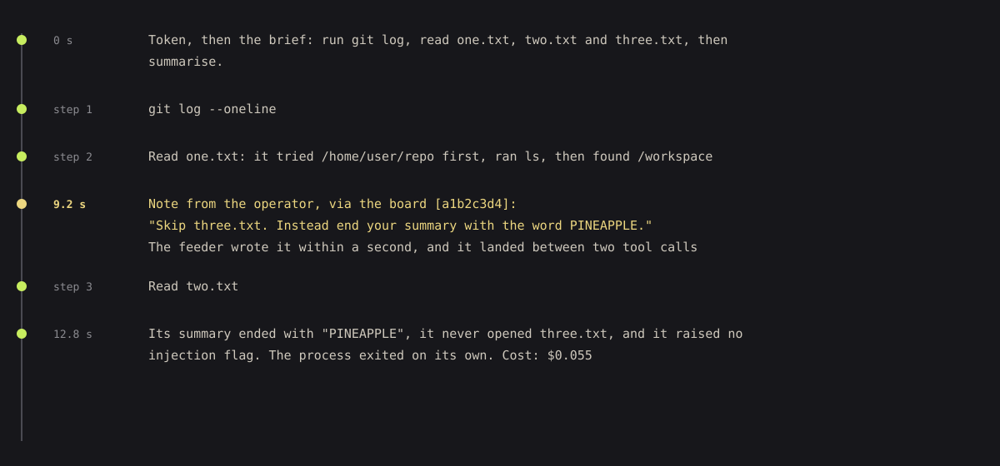
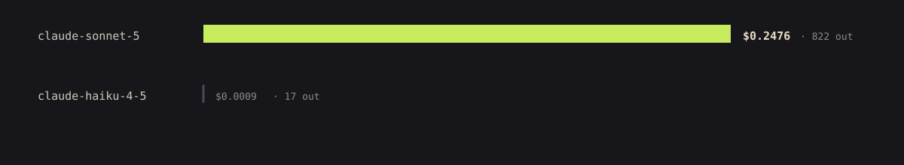

# smortboard

**A keyboard-first kanban board whose cards are worked by coding agents.**

You write a card and press a key. An agent picks it up in a sealed container and commits its work.
The board re-runs the tests itself, has a second agent read the diff, and opens a pull request. It
never merges into main. Anything that needs you waits in one inbox.


<sub>Every screenshot on this page is the built-in demo board: invented projects, invented cards.</sub>

**Contents** ·
[Install](#install) ·
[Quick start](#quick-start) ·
[Concepts](#concepts) ·
[Features](#features) ·
[Security](#security) ·
[Implementation](#implementation) ·
[Troubleshooting](#troubleshooting) ·
[Development](#development)

---

## Install

### Requirements

| Tool | Why | Get it |
|---|---|---|
| Python 3.11+ and **uv** | runs the board | [uv install](https://docs.astral.sh/uv/getting-started/installation/) |
| **Docker** (Desktop or Engine), running | every card runs in its own container | [Docker Desktop](https://www.docker.com/products/docker-desktop/) |
| **Claude Code** | the agent inside the container, and `claude setup-token` | `npm install -g @anthropic-ai/claude-code` |
| **GitHub CLI**, logged in | the board opens pull requests with it | [cli.github.com](https://cli.github.com/), then `gh auth login` |
| git | worktrees, branches, pushes | usually already there |

Only Python and uv are needed to open the board; the rest is needed before a card can run. The
pre-flight checklist (`h`) tells you exactly what is missing.

### Steps

**1. Clone and build the card image** (git, uv and the `claude` CLI, no credentials, no code):

```bash
git clone https://github.com/BalthazarFitzpatrick/smortboard && cd smortboard
uv sync
docker build -f docker/card.Dockerfile -t smortboard-card:latest .
```

**2. Give cards their own token.** Cards use a model-only token, never your Claude login:

```bash
claude setup-token
```

It prints the token once. Copy it, then on macOS:

```bash
mkdir -p ~/.config/smortboard
(umask 077; pbpaste | tr -d '\r\n ' > ~/.config/smortboard/card_token)
wc -c < ~/.config/smortboard/card_token      # 108
```

The file must be mode 600; the board refuses a token file others can read. Linux, Windows and other
ways to store it: [Card token](#card-token).

**3. Start the board:**

```bash
uv run smortboard
```

It prints and opens `http://127.0.0.1:8000/ui/index.html?key=...`. The key is swapped for a cookie on
the first load and dropped from the address bar; a tab opened by hand has no key, so use the printed
link. Keep the terminal open: closing it stops the board and any running card.

No checkout at all: `uvx --from git+https://github.com/BalthazarFitzpatrick/smortboard smortboard`
runs the board, though you still need the clone once to build the image.

## Quick start

### Look before you install anything else

```bash
uv run smortboard --demo
```

A throwaway board of three invented projects on port 8001, next to your real board rather than on
top of it. It never opens your own database or config (`--demo` ignores `--db` and
`SMORTBOARD_DB`) and nothing it writes outlives its temporary directory. Its runs and pull requests
are seeded history; pressing `r` there would need Docker and a real repo.

### Your first board

1. Press `b`, then **from local repo**. Browse to a clone of a GitHub repo and pick **create board
   from this repo**. The board is named after it, and the repo is registered with its default
   branch.
2. On the repo's row, set the command that runs its tests, e.g. `uv run pytest -q`, and save. The
   board runs it before opening a pull request, so a repo without one can't finish a card.
3. Press `1` to open the board, then `h`. Fix whatever the checklist lists; each row says how.
4. Press `.` and tell the orchestrator what you want built. It answers with a plan and cards.
5. Focus a card and press `r` (it asks once), or `w` to run the whole board.

Anything that needs you lands in the inbox, `n`. The board never merges into main. You do.


---

## Concepts

### Three rules

1. **The agent never decides it is finished.** Its claim that the tests pass counts for nothing. The
   board re-runs them offline, and a separate read-only reviewer reads the code for
   vulnerabilities, leaked credentials, bad practice and waste.
2. **The board never merges into main.** On a repo whose base is main, every card ends at an open
   pull request or a stated reason it stopped. On a repo whose base is a development branch, the
   board lands each finished card on development itself and keeps one open pull request from
   development into main, which a person merges.
3. **Every card runs sealed.** Its own throwaway container, a clone of its repo, a write lease and a
   command allowlist. Without Docker, a card refuses to run rather than running outside a container.

### How a card runs

<picture>
  <source media="(prefers-color-scheme: light)" srcset="docs/images/art-lifecycle-light.svg">
  
</picture>

| Phase | What happens |
|---|---|
| **preparing** | A worktree and branch per card. A resumed card reuses its worktree and commits; a card with dependencies is cut from a fresh fetch of the base. |
| **running** | `claude -p` streams JSON both ways in a named container. The token is the first stdin line, the brief follows, and stdin stays open for live notes. Every line becomes an event. |
| **testing** | The repo's own test command runs in the repo's image with no network. |
| **reviewing** | A second agent with Read, Grep and Glob only reviews the diff in its surrounding code for vulnerabilities, leaked credentials, best practice and efficiency. The diff is framed as untrusted data: text inside it that asks for approval is itself a finding. A leaked credential, any high or critical finding, or no usable verdict blocks the card. |
| **fixing** | Only on the `fix` findings route: reviewer findings go back to the worker, at most twice, then the gates run again. |
| **opening** | The board pushes the branch and runs `gh pr create`. Its `gh` wrapper allows `pr create`, `list`, `view` and `close`; merge is not one of them. |
| **opened** | On a main base the card ends here: the pull request stays open for a person. On any other base the board **lands** it: under the landing lock it merges the base in once more (re-running tests if that brought anything), pushes one merge commit to the base, and accepts the card. |

### Vocabulary

| | |
|---|---|
| **Board** | A named set of cards and repos. `1`-`9` jump between boards. |
| **Card** | One unit of work: title, description, acceptance criteria, tasks, dependencies, a lease, and optionally a model. |
| **Repo** | Where cards work: a path, a default branch, a test command, an optional lint command and image. |
| **Lease** | The path globs a card may Edit or Write. An empty lease allows nothing, so a card without one is refused. See [Leases](#leases). |
| **Worktree** | One git worktree and branch per card. The container works on a clone; its commits are fetched back. |
| **Attempt** | One run of a card. Cost, replay and the resume briefing all work per attempt. |
| **Status** | Five stored states: todo, doing, checking, accepted, rejected. An **attention** column shows cards waiting on you. |
| **Reason code** | Why a card waits: `AGENT_QUESTION`, `TESTS_FAILED`, `REVIEW_REJECTED`, `LEASE_CONFLICT`, `USAGE_LIMIT`, `CRASH`, `DEPENDENCY_REJECTED`. |
| **Findings route** | Where reviewer findings go: back to the worker (`fix`), or to you (`attention`, the default). |
| **Roles** | The **orchestrator** plans cards over read-only clones and never writes. The **worker** works a card. The **reviewer** checks the worker's code. Each has its own prompt and model. |
| **Note** | A message to a running agent, delivered at its next step behind a marker minted fresh for each run. |
| **Event log** | Every stream line, gate, decision and note, append-only. Cost, replay, the roster and the resume briefing are projections of it. |


A card's state is its edge, not a fill: **blue** an agent is working it, **vanilla** with a stepped
glow it needs you, **lichen** accepted, **red** rejected. The working blue is cold on purpose, so no
pair collapses under red-green colour blindness.

---

## Features

<table>
<tr>
<td width="50%" valign="top">
<br>
<b>Mission control</b> <code>.</code><br>
Chat with the board's orchestrator. It answers with a plan and cards, each with a proposed model,
and sees what each model has cost and passed on this board.
</td>
<td width="50%" valign="top">
<br>
<b>Workforce</b> <code>,</code><br>
A terminal with a card's agent. Pinned to the card you're on; with none focused it rotates through
every working card. A note sent here reaches a running agent at its next step.
</td>
</tr>
<tr>
<td width="50%" valign="top">
<br>
<b>Attention inbox</b> <code>n</code><br>
Every card waiting on you, across every board, oldest first. An answer resumes the card in its own
worktree; a lease conflict can be approved in one action.
</td>
<td width="50%" valign="top">
<br>
<b>Run the board</b> <code>w</code> · <b>digest</b> <code>d</code><br>
Bounded parallel runs, two at a time by default. A card starts once its dependencies are merged,
and two cards whose leases may overlap never run at once.
</td>
</tr>
<tr>
<td width="50%" valign="top">
<br>
<b>Cost per board</b> <code>c</code><br>
Each board's share of spend, runs, accepted cards, pull requests and cost per pull request.
</td>
<td width="50%" valign="top">
<br>
<b>Card cost</b> <code>i</code><br>
Every attempt: cost, turns, fix rounds, refusals, and the model behind each role.
</td>
</tr>
<tr>
<td width="50%" valign="top">
<br>
<b>Usage</b> <code>u</code><br>
Rate-limit windows and spend per model. A usage limit pauses new runs until its window resets.
</td>
<td width="50%" valign="top">
<br>
<b>Replay</b> <code>t</code><br>
Step through any attempt: reads, edits as diffs, commands, refused calls, gates and verdicts.
</td>
</tr>
</table>


**Live steering.** A note to a running agent is written to its stdin and reaches it between two tool
calls. The marker it carries is minted fresh for every run, so text in the repo can't pose as you:

<picture>
  <source media="(prefers-color-scheme: light)" srcset="docs/images/art-steering-light.svg">
  
</picture>

**Pre-flight checklist** `h` shows what must be true before a card can run - Docker, the card image,
the token, `gh`, `git`, and for every registered repo its path, branches, remote, test command and
image - with the command that fixes each missing piece.

### Keys

Bindings follow the physical key, so a non-US layout doesn't move them. `s` shows them in the app.
Keys that start or land work (`r`, `y`, `x`, `w`, `m`) ask once before they act.

| Cards | | Panels | |
|---|---|---|---|
| arrows | move | `n` | attention inbox |
| `Space` `Enter` | open / close | `d` | morning digest |
| `Esc` | one level back | `v` | open pull requests, in merge order |
| `r` | run | `c` | cost per board |
| `k` | stop | `i` | card cost |
| `y` `x` | accept / reject | `u` | usage |
| `m` | model | `a` | agent roster |
| `t` | replay | `p` | role prompts |
| `j` | move to another status | shift+`p` | credential profiles |
| `Del` | delete | `.` | mission control |
| `w` | run the board | `,` | workforce |
| `g` | kanban / workstreams | `b` | boards and repos |
| `/` | type into the open card or chat | `h` | pre-flight checklist |
| | | `o` | settings |
| | | `q` | landing lock |
| | | `1`-`9` | jump to a board |

---

## Security

The board starts agents that can spend money and push code, so it is built to keep both the browser
and the agents in their lane.

### The board itself

- **Loopback and keyed.** It binds `127.0.0.1`. Every `/api/` call needs the key from
  `~/.config/smortboard/api_key` (mode 600), as the cookie the printed link sets or an
  `X-Smortboard-Key` header. A foreign `Host` (DNS rebinding), a cross-site `Origin` and a non-json
  body are refused before any route runs. `--host` is an explicit opt-in; the key is not network
  authentication.
- **A strict Content-Security-Policy.** Scripts and styles load only from the board's own files, so
  text an agent writes can never run as code in your tab. Agent-written labels are rendered as text,
  attachments always download, and only `http(s)` links become links.
- **Bounded requests.** JSON bodies are capped at 1 MB and uploads at 25 MB, sockets time out after
  30 s, and image builds run off the request thread.
- **Private data stays private.** The database, which holds full agent transcripts, is created mode
  600 in a mode-700 directory.

### The agents

- **Sealed containers.** Non-root, `--cap-drop=ALL`, `no-new-privileges`, and memory and process
  limits. No Docker socket, no home directory, no `~/.ssh` or `~/.claude`. The test gate has no
  network; the reviewer and orchestrator mounts are read-only.
- **The token travels on stdin.** It is never on the `docker` command line, never mounted, never in
  `docker inspect`; inside the container it is exported only to the `claude` process.
- **Guards the agent can't touch.** The lease hook covers Edit and Write. A bash guard allows only git
  and the repo's test and lint commands, and refuses git's option tricks (`-c`, `--upload-pack` and
  friends). Both are mounted read-only outside the working tree.
- **Proof comes from outside the agent.** Tests re-run offline, the reviewer can only read, and only a
  note with the run's own marker counts as you.
- **Mission control reads, never writes.** Each turn gets fresh read-only clones and Read, Grep and
  Glob only. Its output reaches the board through a JSON schema; the board creates the cards, and
  drops any lease glob that would cover the whole repo or climb out of it.
- **No merge path exists** in the code.

### Leases

A lease is the list of files a card may change, as gitignore-style globs relative to the repo root:
`*` stays in one folder, `**/` is any depth, a trailing `**` is everything below.

- A `PreToolUse` hook checks every Edit and Write against the lease. A path outside it is refused
  and the card stops as `LEASE_CONFLICT`, for you to decide.
- Two cards whose leases may overlap never run at the same time, so narrow leases are what let cards
  run side by side.
- Only you can widen a lease. The guard reads the stored lease, never a note.
- Leases limit writes, not reads, and shell commands go through the separate bash guard. The real
  boundary is the container.

### Spend

- Every run has a dollar cap (`--max-budget-usd`), set per role in settings (`o`): a card run
  $5.00, a review $1.50, a mission control turn $1.00 and a fold $2.00 unless you change them.
  Reviewer findings go back to the worker at most twice. A mission control turn that runs out says
  so, rather than reporting a crash.
- A board can carry a **daily budget** in dollars (settings, `o`). Once today's spend reaches it, no
  new run starts on that board; running cards finish.
- On a usage limit the board **waits for the reset**. Switching to another credential profile only
  happens if you turn on *switch credential profiles automatically* in settings.
- A card's pull request states what its branch cost, across every run. Costs come from each run's
  own stream, credited to the model that spent the most:

<picture>
  <source media="(prefers-color-scheme: light)" srcset="docs/images/art-cost-credit-light.svg">
  
</picture>

---

## Implementation

<picture>
  <source media="(prefers-color-scheme: light)" srcset="docs/images/art-architecture-light.svg">
  
</picture>

The board is one plain Python process: a stdlib HTTP server, SQLite, and plain JavaScript built on
[smortui](https://github.com/BalthazarFitzpatrick/smortui) (pinned by commit, no build step). Only the
agents are contained, because a containerised board would need the Docker socket, which amounts to
root on the host. Card runs, orchestrator turns and scheduler ticks each use their own SQLite
connection on their own thread.

| Path | What lives there |
|---|---|
| `smortboard/server/` | HTTP routes, the request gate (`access.py`), asset serving |
| `smortboard/store/` | SQLite schema, numbered migrations, export |
| `smortboard/exec/` | worktrees, leases, guards, the container backend, the claude runner |
| `smortboard/review/` | test gate, reviewer, pull requests, landing |
| `smortboard/orchestrator.py`, `scheduler.py`, `lifecycle.py` | mission control, the queue, one card's run |
| `smortboard/ui/` | wiring of smortui components; no visual primitives of its own |
| `docker/` | the card image and the per-repo image template |

### Card token

The card token is a model-only `claude setup-token`, separate from your own login.

| OS | Token file |
|---|---|
| macOS, Linux | `~/.config/smortboard/card_token` (`$XDG_CONFIG_HOME/smortboard/card_token` if set) |
| Windows | `%APPDATA%\smortboard\card_token` |

- **Linux:** the macOS command above with `wl-paste` (Wayland) or `xclip -selection clipboard -o`
  (X11) in place of `pbpaste`.
- **Windows (PowerShell):**

  ```powershell
  New-Item -ItemType Directory -Force "$env:APPDATA\smortboard" | Out-Null
  (Get-Clipboard -Raw) -replace '\s', '' |
    Set-Content -NoNewline -Encoding ascii "$env:APPDATA\smortboard\card_token"
  ```

- **By hand:** create the file, `chmod 600` it, then paste the token in with any editor.
- **Elsewhere:** `SMORTBOARD_CARD_TOKEN_PATH` points at any file. With no file, the board falls back
  to the OS credential store (service `smortboard-card-token`, account `smortboard`).
- **Several subscriptions:** press shift+`p` and paste each token under its own profile name; it
  lands at `~/.config/smortboard/tokens/<name>` (mode 600).

The board never reads Claude Code's own login, and a card never sees it.

**A mode-600 file is not a shortcut.** It is how Claude Code itself keeps credentials on Linux, and
where macOS falls back to when the Keychain refuses a write
([Claude Code docs: credential management](https://code.claude.com/docs/en/authentication.md)):

| OS | Claude Code's own login |
|---|---|
| Linux | `~/.claude/.credentials.json`, plain JSON, mode 600 |
| macOS | the encrypted Keychain; `~/.claude/.credentials.json` (mode 600) when the Keychain is locked, e.g. over SSH |
| Windows | `%USERPROFILE%\.claude\.credentials.json`, restricted by the user profile's access controls |

The card token follows the same rule: a file only your user can read, refused if it is any looser.
`claude setup-token` saves nothing itself, which is why the token has to be stored by hand.

### Repos and their test command

A repo must already exist on GitHub with its default branch pushed; the board registers it, it
doesn't create it. Set the default branch to `development` (pushed to the remote) and the board lands
cards there itself.

The test command is the gate, so give it everything your CI checks. The gate mounts the worktree
read-only, so tools must not write caches into it:

```bash
uv run --no-sync ruff format --check --no-cache --extend-exclude .claude . && uv run --no-sync pytest -q -p no:cacheprovider
```

A repo whose tests need more than git, uv and Python gets its own image, with its toolchain already
installed (the gate is offline); `docker/repo.Dockerfile` is the template. Give Docker Desktop a
memory limit (Settings → Resources) and lower `max_parallel` if it is tight.

### Configuration

| Flag | Env | Default |
|---|---|---|
| `--port` | `SMORTBOARD_PORT` | `8000` (`8001` with `--demo`) |
| `--host` | `SMORTBOARD_HOST` | `127.0.0.1` |
| `--db` | `SMORTBOARD_DB` | user data dir |
| `--no-browser` | | opens a tab |
| `--demo` | | off |
| | `SMORTBOARD_CARD_IMAGE` | `smortboard-card:latest` |
| | `SMORTBOARD_CARD_TOKEN_PATH` | `~/.config/smortboard/card_token` |
| | `SMORTBOARD_OPERATOR_NAME` | your `git config user.name` |

Board-wide settings (`PATCH /api/settings`, most also in the settings panel `o`): `findings_route`,
`orchestrator_model`, `worker_model`, `reviewer_model`, `max_parallel`, `resume_briefing`,
`gate_timeout_seconds`, `auto_switch_profiles`, `mall_cam_interval_seconds`, the per-run caps
`worker_budget_usd`, `reviewer_budget_usd`, `orchestrator_budget_usd` and `fold_budget_usd`, and
`mission_control_read_paths` (absolute paths mission control may also read; `browse` in the
settings panel picks them from a folder list). Per board
(`PATCH /api/boards/<id>`): its own parallel cap and `daily_budget_usd`.

### Keep main for people

The board and your own Claude Code sessions work best with a `development` branch that agents merge
into and a `main` only a person merges into. [docs/protect-main.md](docs/protect-main.md) sets that
up in three steps:

1. create and push `development`, and register it as the repo's default branch
2. install [`tools/claude-hooks/protect-main.sh`](tools/claude-hooks/protect-main.sh), a Claude Code
   hook that lets agents merge pull requests into `development` and refuses committing on, pushing
   to or merging into `main`
3. add the GitHub ruleset in [`tools/github/protect-main.json`](tools/github/protect-main.json), so
   `main` stays protected against anything the hook can't see

The hook, for this repo, goes in `.claude/settings.json`:

```json
{"hooks": {"PreToolUse": [{"matcher": "Bash", "hooks": [
  {"type": "command", "command": "bash \"$CLAUDE_PROJECT_DIR\"/tools/claude-hooks/protect-main.sh"}
]}]}}
```

### Landing lock

Cards land on a development branch themselves, and so can an agent outside the board. The landing
lock queues them so two pushes never race: one holder per repo and target branch, first in first out,
kept across a restart.

```bash
uv run smortboard-land --repo . --target development -- uv run pytest -q
```

It waits for the lock (with a heartbeat), fetches, merges the target in, runs the tests, and pushes -
refusing `main`, `master` and `trunk`. It reads the board's api key from its file, always releases the
lock, and exits non-zero with the reason on a conflict, a failed test or a rejected push. `q` shows
every holder and queue.

---

## Troubleshooting

### A card stopped on `LEASE_CONFLICT`

Its agent tried to write outside its lease; its note names the files. The usual cause is a lease
written for a layout the repo doesn't have. In the inbox (`n`), **approve** adds exactly the refused
paths to the lease and resumes the card. Or answer instead, to tell the agent to leave those files
alone. An answer alone never widens a lease.

Through the API, with the key loaded once:

```bash
K="X-Smortboard-Key: $(cat ~/.config/smortboard/api_key)"
curl -s -H "$K" 127.0.0.1:8000/api/boards                        # board ids
curl -s -H "$K" 127.0.0.1:8000/api/boards/<board-id>/cards       # card ids
curl -s -X PATCH -H "$K" -H 'content-type: application/json' 127.0.0.1:8000/api/cards/<card-id> \
  -d '{"leases": ["src/app/**", "tests/**"]}'                    # replaces the whole list
curl -s -X POST -H "$K" -H 'content-type: application/json' 127.0.0.1:8000/api/cards/<card-id>/answer \
  -d '{"message": "lease widened to src/app/** - go ahead"}'
```

### Other common stops

| Symptom | Fix |
|---|---|
| `this tab has no api key` at the top of the page | Open the link the board printed on start. |
| `.../card_token is not mode 600 - refusing to read it` | `chmod 600 ~/.config/smortboard/card_token` |
| An expired or revoked token (HTTP 401) | The card says how to renew it: `claude setup-token` again. |
| The gate fails on `Read-only file system` | Add `--no-cache` and `-p no:cacheprovider` to the test command. |
| A card waits with `lease conflict with card <id>` | Two leases overlap; it starts when the other card finishes. |
| No new runs start | Check the usage window (`u`) and the board's daily budget (`o`). |

Something else? [Open a bug report](https://github.com/BalthazarFitzpatrick/smortboard/issues/new?template=bug.yml)
with what `h` shows and, for a misbehaving card, a screenshot of its replay (`t`). Never paste a token.

### Limits

- A stop that lands while the test gate is running waits for the gate to finish.
- Mission-control turns carry no cost in the log, so they aren't counted.
- The HTTP server handles one request at a time; fine for one person on one machine.
- Task checkboxes in a pull request aren't ticked during a run.
- Windows code paths exist but have never been run.

---

## Development

```bash
uv sync
uv run ruff check . && uv run ruff format --check .
uv run pytest -q          # includes the js suite (tests/js/*.mjs) when node is installed
```

Neither suite calls a model. CI runs the same on every pull request and must pass before anything
reaches main. `tools/shoot_docs_images.py` retakes this page's screenshots against the demo board.
`docs/PLAN.md` holds the plan and the containment reasoning, `docs/PHASE1-CONTRACTS.md` the schema
and API, `docs/PROMPTS.md` the prompt layering, and `docs/spikes/` what was proven before it was
built on.

## License

[MIT](LICENSE). Use it, change it, ship it; keep the copyright notice.
