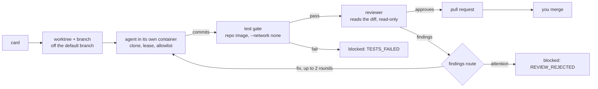

# smortboard

A keyboard-first kanban board whose cards are worked by coding agents. You write a card, press a
key, and an agent picks it up in a sealed container. The board then re-runs the tests itself, has a
second agent review the diff, and opens a pull request. It never merges. When a card needs you, it
waits in one inbox. You can steer an agent while it runs, and replay every step afterwards.

```
 you write a card ─► agent works it ─► board re-runs tests ─► reviewer reads diff ─► pull request
                     (own container)    (offline container)    (read-only tools)       you merge
```

## Contents

- [Start](#start)
- [One-time setup for running cards](#one-time-setup-for-running-cards)
- [How a card runs](#how-a-card-runs)
- [Working the board](#working-the-board)
- [Keys](#keys)
- [Security](#security)
- [Cost](#cost)
- [Configuration](#configuration)
- [Development](#development)

## Start

```bash
git clone https://github.com/BalthazarFitzpatrick/smortboard && cd smortboard
uv sync
uv run smortboard
```

This serves the board on `http://127.0.0.1:8000/ui/index.html` and opens a browser tab. The database lives in your user data directory, so running the command from any folder never
leaves a stray `.db` file behind. The board only listens on this machine. See [Security](#security)
before you pass `--host`.

## One-time setup for running cards

The board opens with nothing else installed. To run cards it needs the three things below. If one
is missing, the board refuses to run the card and says which one. It never falls back to running
the agent outside a container.

**1. Docker, running.** Each card runs in its own throwaway container, with a clone of its repo and
nothing else of yours.

**2. The card image**, built once:

```bash
docker build -f docker/card.Dockerfile -t smortboard-card:latest .
```

It holds the `claude` CLI, git and uv. It does not hold any credential or any copy of your code.

**3. A card token.** This is a model-only token, separate from your own login:

```bash
claude setup-token                                    # prints a one-year token
mkdir -p ~/.config/smortboard
(umask 077; pbpaste | tr -d '\r\n ' > ~/.config/smortboard/card_token)   # copy it first
```

The file is mode 600 and the board reads it first. `SMORTBOARD_CARD_TOKEN_PATH` moves it
somewhere else. Without the file, the board falls back to the OS credential store, but on macOS
every read from there raises a Keychain prompt.

**Per repo:** a card runs against a repo you register on its board: a path, a default branch, a
test command, and optionally a lint command and an image. The test and lint commands are the only
shell commands a card may run besides git. The test gate runs offline, so the repo's image has to
contain its toolchain already. For smortboard itself that image is `docker/repo.Dockerfile`:

```bash
docker build -f docker/repo.Dockerfile -t smortboard-repo:latest .
```

## How a card runs

Focus a card and press `r`. The foot of the card shows each phase as it happens. The same steps run
in the same order every time:



- **The agent does not get to decide it is finished.** The board re-runs the tests itself, in a
  second container with no network, and a separate reviewer reads the diff. The reviewer checks for
  vulnerabilities, leaked credentials, best practices and efficiency, and returns a structured
  verdict.
- **A blocked card stays in its column.** It carries a reason code instead: `AGENT_QUESTION`,
  `TESTS_FAILED`, `REVIEW_REJECTED`, `LEASE_CONFLICT`, `USAGE_LIMIT`, `CRASH` or
  `DEPENDENCY_REJECTED`. It glows vanilla until someone deals with it.
- **You decide the outcome.** On a card in checking, `y` accepts it (lichen edge) and `x` rejects
  it (red edge). Both flip back if you change your mind. Rejecting a card deletes its branch, so its
  next run starts clean.

## Working the board

**Mission control (`.`).** A chat with the board's orchestrator. Describe what you want and it
answers with a plan and proposed cards, each with a model it thinks fits. The cards appear on the
board, and you still start them yourself. The orchestrator also sees the board's own history: what
each finished card cost, how often each model got a clean pull request, and what it cost on
average. It uses that when it proposes the next plan.

**Workforce and live steering (`,`).** A terminal-style chat with the focused card's agent. A note
you send while the card runs reaches the agent at its next step, typically between two tool calls.
Each note carries a fixed marker, and the agent's system prompt teaches it to trust that marker and
to treat any other text that claims authority as a prompt injection. Every note is also saved as a
comment, so the next run's brief includes it.

**Attention inbox (`n`).** Every card waiting on you, across every board, oldest first. For a card
blocked on a question, a failed test, a rejected review, a crash or a lease conflict, your answer
becomes a comment and the card resumes in its existing worktree, commits and all. For a decision or
a rate limit, the inbox tells you where that gets handled instead. The counter in the top-right
corner shows how many cards are waiting, even while the inbox is closed.

A resumed run's brief also carries a resume briefing: a compact summary of the latest attempt that
reached the worker - how it ended, files it touched, commands it ran and any that were refused, its
final summary - plus one line per older attempt, read straight off the event log. This is what lets
the agent skip re-reading the worktree to rediscover what it already did. Turn it off board-wide
with the `resume_briefing` setting.

**Run the board (`w`) and the digest (`d`).** `w` works through every todo card on the board, two
at a time by default (`max_parallel`). A card waits until all its dependencies are accepted, and
two cards whose leases might touch the same file never run together. A usage limit pauses new starts
until the window resets. Press `w` again to empty the queue; cards already running finish. The
morning digest lists the pull requests opened since you last looked, in dependency order, plus
whatever is waiting on you. It flags any pull request whose dependency has no pull request yet in
the same batch.

**Cost (`i`) and usage (`u`).** `i` on a card shows every attempt with its cost, turns, fix rounds,
refusals and the model that did the work. Without a focused card, `i` shows the board's cost table,
including how much went to runs that hit a refusal. `u` shows your rate-limit windows and spend per
model.

**Replay (`t`).** Step through a card's run: every narration, read, edit (as a diff), command,
refused call, test gate, verdict and pull request, in order. Use the switcher to pick an earlier
attempt.

**Prompts (`p`).** Edit the orchestrator, worker and reviewer prompts. Every save becomes a new
version, and the older versions are kept.

**Models (`m`).** Cycle the focused card through the board default, haiku, sonnet and opus.

## Keys

Every binding follows the physical key, so a non-US layout doesn't move them. `s` opens this table,
built from the same list the key handlers use.

| Key | Action |
|---|---|
| arrows | move between cards and columns |
| Enter | open the focused card |
| Space | open the focused card, or close the open one |
| Escape | one level back: input, then panel, then closed |
| `y` / `x` | accept / reject the card |
| `r` | run the focused card |
| `m` | change the focused card's model |
| `t` | replay the focused card's run |
| `w` | run the board / stop the queue |
| `g` | switch kanban / workstream grouping |
| `n` | attention inbox |
| `d` | morning digest |
| `i` | cost telemetry |
| `c` | cost overview: spend across every board |
| `u` | usage |
| `a` | agent roster |
| `p` | prompts |
| `s` | this table |
| `/` | focus a panel's input |
| `,` | workforce: the focused card's agent |
| `.` | mission control: the board's orchestrator |
| `1`-`9` | jump to a board |

## Security

The board runs agents that read untrusted input, so the design assumes an agent may try something
it shouldn't, and limits the damage it could do.

- **The board only listens on this machine.** The API has no authentication, and one request can
  start a run that spends your token. `--host` or `SMORTBOARD_HOST` opens it to other machines, but
  only do that behind something that authenticates.
- **Only the cards run in containers.** The board itself runs natively. Letting a containerised
  board start containers would mean giving it the Docker socket, which amounts to root on the host.
- **The token arrives on stdin.** It is never an env var, never a mounted file and never visible to
  `docker inspect`. The token file on the host is never mounted into a container.
- **Guards are read-only.** A lease hook limits Edit and Write to the card's path globs, and an
  empty lease allows no writes at all. A bash guard limits the shell to git plus the repo's own test
  and lint commands. Both are mounted read-only outside the working tree, so an agent can neither
  edit them nor commit them.
- **Nothing an agent says counts as proof.** The tests run again offline, and the reviewer can only
  read (Read, Grep, Glob) and return its verdict. A mid-run note is only trusted when it carries
  the fixed marker.
- **The board never merges.** No code path can: the pull request is where the board stops. Only a
  person merges.

## Cost

- Workers and the reviewer default to sonnet and the orchestrator to opus. A card's own model
  overrides the board setting, which overrides the default. The reviewer has its own setting, so
  choosing a cheap worker doesn't make the review cheap.
- Each worker run has a $5 ceiling (`--max-budget-usd`), and review findings go back to the worker
  at most twice before the card goes to you. By default findings go straight to you, since a card
  fixing its own findings unattended spends tokens nobody asked for.
- The cost figures come from the run's own stream: `total_cost_usd`, `num_turns` and `modelUsage`
  per result. The "model that did the work" is the one with the highest spend. Claude Code also
  bills a small haiku helper on every run, and that doesn't count.

## Configuration

| Flag | Env | Default |
|---|---|---|
| `--port` | `SMORTBOARD_PORT` | `8000` |
| `--host` | `SMORTBOARD_HOST` | `127.0.0.1` |
| `--db` | `SMORTBOARD_DB` | user data dir |
| `--no-browser` | | opens a tab |
| | `SMORTBOARD_CARD_IMAGE` | `smortboard-card:latest` |
| | `SMORTBOARD_CARD_TOKEN_PATH` | `~/.config/smortboard/card_token` |

A flag wins over its env var, which wins over the default. The board-wide settings
(`findings_route`, `orchestrator_model`, `worker_model`, `reviewer_model`, `max_parallel`,
`resume_briefing`) are set with `PATCH /api/settings`. `resume_briefing` set to `"off"` turns off
the resume briefing (see below); unset means on.

## Development

```bash
uv run pytest                               # the python suite
for f in tests/js/*.mjs; do node "$f"; done # the ui, against a stub DOM
uv run ruff check . && uv run ruff format --check .
```

Neither suite calls a model or Docker. Card runs are exercised with a fake process and scripted
stream-json. State lives in SQLite and is gitignored, and `Store.export()` writes a portable bundle
you can move between machines.

The interface is built on [ui_base](https://github.com/BalthazarFitzpatrick/ui_base), pinned by
commit sha. `docs/PLAN.md` holds the phased plan and the reasoning behind containment,
`docs/PHASE1-CONTRACTS.md` the schema and API, `docs/PROMPTS.md` the prompt layering, and
`docs/spikes/` what each spike proved or disproved before anything was built on it.
