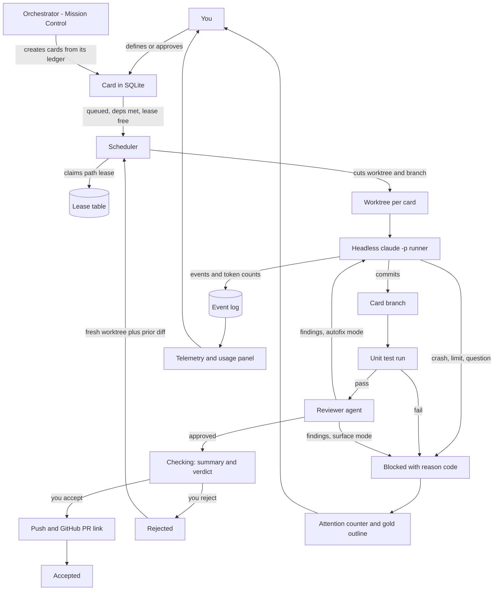

# smortboard — implementation plan

## Context

Fabian wants to get good at defining work precisely and then leaving it alone. Today that means
hand-running Claude Code sessions, hand-cutting worktrees (wowtomate already carries three under
`.claude/worktrees/`), and hand-tracking state in `TASKS.jsonl`. It works, but it demands presence:
the work only moves while he is watching it.

smortboard is a convenience wrapper around coding agents that removes that requirement. Cards are
defined in detail up front, handed to headless Claude Code sessions running in isolated worktrees,
and surfaced back only when they need a decision. It is explicitly **not** a harness — it does not
reimplement the agent loop, it schedules and observes one.

The design test for every feature: does it help him walk away? Anything that rewards hovering is
wrong.

Source brief: `smortboard/dev-board-brief.md`. All `[OPEN]` and `[FLAG]` items in it are resolved
below.

---

## Locked decisions

| Area | Decision |
|---|---|
| Execution | Headless Claude Code (`claude -p`) per card. Ollama deferred. |
| Credential | The interactive subscription seat. Contention parks the card for attention. |
| Isolation | One git worktree + branch per card. Repo is a card attribute; a board declares its repos. |
| Concurrency | Parallel by default, as far as leases and the seat allow. |
| Store | SQLite, gitignored. `smortboard export` produces a portable bundle on demand. |
| History | Retained. Append-only event log per card. |
| Truth | Cards are ground truth. The orchestrator keeps its own plan ledger, derived from and reconciled against them. |
| Statuses | To do / Doing / Checking / Accepted / Rejected, plus **Blocked** with a reason code. |
| Gate to Checking | Unit tests pass **and** reviewer approves. |
| Merge | Board pushes and links the GitHub PR. Board never merges. |
| Rejection | Fresh worktree from base, plus a read-only diff of the failed attempt. |
| Outputs | Always a git commit — decisions and documents included. |
| Prompts | Layered by **role** only: orchestrator, worker, reviewer. |
| UI | ui_base first, domain-free vocabulary. Git pin, sha while co-developing. PyPI whenever it chafes. |
| Packaging | Docker + browser. No desktop app. |
| Out of scope | Ollama, workstream column mode, scheduling/digest, Omarchy, fish_gate. |

### Resolved from the brief's open flags

- **§4.2 mode switch** — a `.toggle` in the top bar, key `g`. Workstream mode ships after v1.
- **§5 modifier scheme** — `,` opens Workforce (left), `.` opens Mission Control (right). Both
  `Cmd+←` and `Alt+←` are browser Back on some platform, so neither is capturable in a browser-based
  app. Brackets were the first proposal and were wrong: they need AltGr on several European layouts.
  **All keyboard bindings resolve on `event.code`, not `event.key`** — the physical key position is
  layout-independent, and only the printed character moves. The shortcut overlay (`s`) labels keys
  from `navigator.keyboard.getLayoutMap()` where available, falling back to the US character.
- **§5 focus model** — a panel sliding in leaves focus on the board. `/` enters its input. `Esc` is
  always exactly one level back: input → panel → closed.
- **§5 card-open arrows** — arrows move between the open card's sections, not between columns.
- **§5 globals** — `u` (usage dropdown) and `s` (shortcut overlay) work everywhere; neither takes
  text input.
- **§4.1 boards** — `←`/`→` on the top bar, and `1`–`9` jump directly (a jump animates as if the
  target were adjacent, rather than scrolling through the boards between).
- **§4.4 empty workforce panel** — hazard stripes with "no card selected".
- **§6 naming** — `.rubber-band` in ui_base already means the shift-drag selection net. The focus
  motion is a new component, `.focus-marker`.
- **§11 scheduling** — reinterpreted as a daily digest over cards, not recurring cards. Post-v1.
- **§12 Omarchy** — dropped. A plugin is a QML/Quickshell bar widget or panel and cannot be a
  standalone application, so it could only ever have been a small status indicator pointing at the
  board. Not worth the surface area.

---

## Architecture



### Blocked reason codes

`CRASH`, `USAGE_LIMIT`, `LEASE_CONFLICT`, `AGENT_QUESTION`, `TESTS_FAILED`, `REVIEW_REJECTED`,
`DEPENDENCY_REJECTED`. The code drives what the attention entry says and whether a retry is
automatic. Mirrors the `blocked_reason_code` convention already in `TASKS.jsonl`.

### Repo layout

```
smortboard/
  smortboard/
    store/        sqlite schema, migrations, export
    exec/         worktree manager, lease store, claude runner, event log
    review/       test runner, reviewer agent, merge request builder
    orchestrate/  mission control session, role prompts, orchestrator ledger
    server/       http api, asset serving (own files first, ui_base fallback)
    ui/           configuration of ui_base components only - no new UI primitives
  tests/
  docker/
```

`ui/` holds wiring, not widgets. Any visual primitive that does not exist goes to ui_base. This is
the brief's hard constraint and it is load-bearing for the whole plan.

---

## Spikes — before Phase 2 locks

Each names what would confirm the assumption and what would falsify it. The plan is provisional
until all three have run.

**S1 — CONFIRMED 2026-09-08, see `docs/spikes/S1-S2-findings.md`.** Run one real card end to end in a scratch worktree.
*Confirms:* `claude -p` accepts a prompt, runs to completion non-interactively, emits parseable
events, reports token counts, and commits. *Falsifies:* it needs a TTY, cannot report tokens, or
gives no completion signal distinguishable from a crash — any of which forces the Agent SDK instead,
and re-plans Phase 2 entirely.

**S2 — CONFIRMED 2026-09-08, see `docs/spikes/S1-S2-findings.md`.** Run two headless sessions against the one interactive
subscription seat while it is in use. *Confirms:* they queue or fail cleanly with a detectable
signal we can map to `USAGE_LIMIT`. *Falsifies:* they degrade silently or corrupt the interactive
session — which makes parallelism (Phase 5) dependent on separate credentials, not just leases.
Also establishes what subscription quota is actually readable; per Fabian's own playbook the status
line is the only surface that exposes it, so §4.6's quota display may reduce to token counts only.

**S3 — lease enforcement.** Determine how a write outside a card's declared paths is detected.
*Confirms:* a viable mechanism exists (hook on the agent's writes, or `git status` diffing against
the lease at commit time). *Falsifies:* detection is only possible after the fact — which makes
leases advisory and moves conflict handling to merge time.

---

## Phases

Each phase is independently shippable and testable. **v1 is Phases 0–6.**

### Phase 0 — ui_base foundations

Ships as ui_base `v0.2.0`. Domain-free naming throughout: no `card`, `board`, `kanban`, `agent`.
Only what Phase 1 needs; the drawer, meter and log arrive in later phases.

```
unit:     bucket layout with 2D roving focus
expects:  a container, an ordered list of buckets, each with an ordered list of row elements
does:     lays buckets side by side and owns arrow-key focus movement across two axes, including
          the escape upward out of the first row
outputs:  focus events naming bucket and row; a `moveTo(bucket, row)` API
verifies: five buckets, three rows each. Right from bucket 1 row 2 lands on bucket 2 row 2. Up from
          any row 0 emits `exit-top` rather than moving. Left from bucket 0 does not wrap.
```

```
unit:     expander
expects:  a strip element, a collapsed aspect ratio and an expanded one
does:     animates a landscape strip into a centred portrait panel and back; dismiss on outside
          click and on Escape
outputs:  open/close events; the panel element for the host to fill
verifies: a 3:1 strip opens to a 1:3 panel centred in the viewport within the animation duration;
          a click on the backdrop closes it; Escape closes it; neither fires twice.
```

```
unit:     count badge
expects:  a host element and a number
does:     renders a count indicator, hidden at zero
outputs:  none beyond the DOM
verifies: value 0 renders nothing visible; value 3 renders "3"; value 100 does not change the host
          element's height.
```

```
unit:     focus marker
expects:  the element focus is moving to
does:     glides a cream highlight from the previous focused element to the new one
outputs:  none
verifies: moving focus across a bucket boundary animates once, not twice, and the marker ends
          exactly on the target's border box.
```

```
unit:     hazard stripes
expects:  a container and a label
does:     fills it with a diagonal striped placeholder carrying the label
outputs:  none
verifies: renders in both light and dark theme using tokens only, no colour literals.
```

**Ships when:** `uv run pytest` passes in ui_base, the asset tests cover the new files, and a demo
page exercises all five.

### Phase 1 — the board, no agents

A usable manual kanban. No agent touches anything yet, which makes every later phase's failures
unambiguously about execution.

- SQLite schema and migrations: boards, repos, cards, attributes, attachments, dependencies, events.
- `smortboard export` writing a portable bundle.
- HTTP server, serving own `ui/` files first with ui_base as fallback, per ui_base's documented
  pattern.
- Card CRUD with every §7 field except telemetry: title, workstream, status, description, tasks,
  acceptance criteria, dependencies both directions, attachments, comments, review flag.
- Kanban columns, card strip and expanded panel, wired from Phase 0 components.
- The full keyboard model as resolved above.
- Docker image.

**Ships when:** the whole-system test below runs up to "card exists and is navigable", cards survive
a container restart, and `export` round-trips.

### Phase 2 — one card executes

Depends on S1 and S3.

- Worktree manager: cut, track and destroy a worktree + branch per card, in the card's repo.
- Lease store: paths claimed at card definition, enforced by the mechanism S3 establishes.
- Claude runner: headless `claude -p` in the worktree, streaming events into the event log.
- Blocked state with reason codes; gold outline; attention counter.
- Stop button, and "pause and review with orchestrator". No mid-flight card edits.

**Ships when:** one card runs unattended, commits to its branch, and reaches Checking or Blocked
with a correct reason code.

### Phase 3 — the gates

- Unit test runner per card, derived from acceptance criteria.
- Reviewer agent: practices, vulnerabilities, inefficiencies, leaked credentials, performance.
- Review setting per card with global override: findings auto-fixed by the worker, or surfaced via
  attention.
- Worker summary and reviewer verdict rendered in the card.
- Merge request: push the branch, surface the GitHub PR link. Never merge.
- Rejection: destroy the worktree, cut fresh from base, attach a read-only diff of the attempt.
- Dependent cards of a rejected card get the yellow highlight for review.

**Ships when:** the whole-system test passes end to end.

### Phase 4 — Mission Control

- ui_base: the sliver drawer component.
- Orchestrator session, role-layered prompts (orchestrator / worker / reviewer), versioned in the
  store and editable in the UI.
- Orchestrator ledger: its own plan, reconciled against cards on each update. Cards stay ground
  truth; the ledger is how it plans rather than how it records.
- Orchestrator creates cards directly; Fabian amends.
- `.` toggles the panel; workforce drawer ships as hazard-striped placeholder.

**Ships when:** a conversation in Mission Control produces cards on the board that pass Phase 3.

### Phase 5 — parallelism

Depends on S2.

- Multiple cards executing concurrently, bounded by lease conflicts and seat contention.
- Dependency-ordered scheduling.
- Seat contention parks a card as `USAGE_LIMIT` rather than failing it.
- Resume briefing: a card resuming after a break is handed its event log's summary — what changed,
  what is next, which file to open — instead of re-ingesting the worktree. Toggleable per Fabian's
  §2 request.

**Ships when:** three cards across two repos run concurrently and all three merge cleanly.

### Phase 6 — telemetry and workforce

- ui_base: log component, quota meter.
- Workforce panel, `,`, defaulting to the **result** view — diff, files touched, last decision,
  summary — with the live stream a deliberate second press. This inverts §4.4's stated default on
  purpose: §1 says watching is a failure mode, and the panel as briefed rewards it.
- Telemetry section per card, `i`: model per task, input/thinking/output tokens.
- `u` usage dropdown, built from ui_base `Menu` with columns and dividers, scoped to whatever S2
  proved is actually readable.

**Ships when:** token counts reconcile against the event log for a completed card.

### After v1

Workstream column mode; Ollama plus the documented board transport protocol; daily digest.

---

## Documentation, per §13

Each phase ships its own API documentation as part of the phase, not afterwards: the HTTP API in
Phase 1, the event log schema and runner contract in Phase 2, the review and merge contracts in
Phase 3, the prompt layering in Phase 4. The board transport protocol is written when Ollama
arrives, not before — writing it against a single provider would fossilise Claude's semantics as the
spec.

---

## Whole-system test case

The smallest scenario exercising the assembled units, not each in isolation:

> A card titled "add a `--version` flag to the smortboard CLI", repo `smortboard`, with acceptance
> criteria "running `smortboard --version` prints the version from `pyproject.toml` and exits 0",
> and a path lease on `smortboard/cli.py`.

Expected: the card moves To do → Doing, gets a worktree and branch, is worked by a headless Claude
Code session that commits, has its generated unit test executed and passed, is approved by the
reviewer, and arrives in Checking carrying a worker summary and a reviewer verdict. The merge button
yields a GitHub PR link. Accepting moves it to Accepted; rejecting destroys the worktree, cuts a
fresh one, and attaches the prior diff.

This is what catches a wrong seam — a runner that commits but reports no tokens, a lease that is
claimed but never released, a reviewer that approves before tests finish.

## Verification

- `uv run pytest` in both repos; ruff clean before every commit.
- ui_base asset tests extended per Phase 0 — serving what it should not, failing to serve what a
  consumer links, shipping broken CSS or JS.
- The whole-system test run against the smortboard repo itself, which is also the dogfood case: the
  board's own first workstream spans smortboard and ui_base, which is exactly why repo is a card
  attribute.
- Docker image builds and the board survives a container restart with state intact.

## Risks

- **S1 falsified** — headless Claude Code cannot be driven per card. Forces the Agent SDK and
  re-plans Phase 2. Highest-impact unknown; spike first.
- **One seat, parallel cards** — S2 decides whether Phase 5 is a scheduling problem or a credentials
  problem.
- **Lease detection after the fact** — makes conflict handling a merge-time concern rather than a
  write-time one, weakening the "come back to clean branches" promise.
- **ui_base gating** — every phase's UI depends on ui_base landing first. Additive components mean
  wowtomate needs no pin bump, but a signature change would break it.
