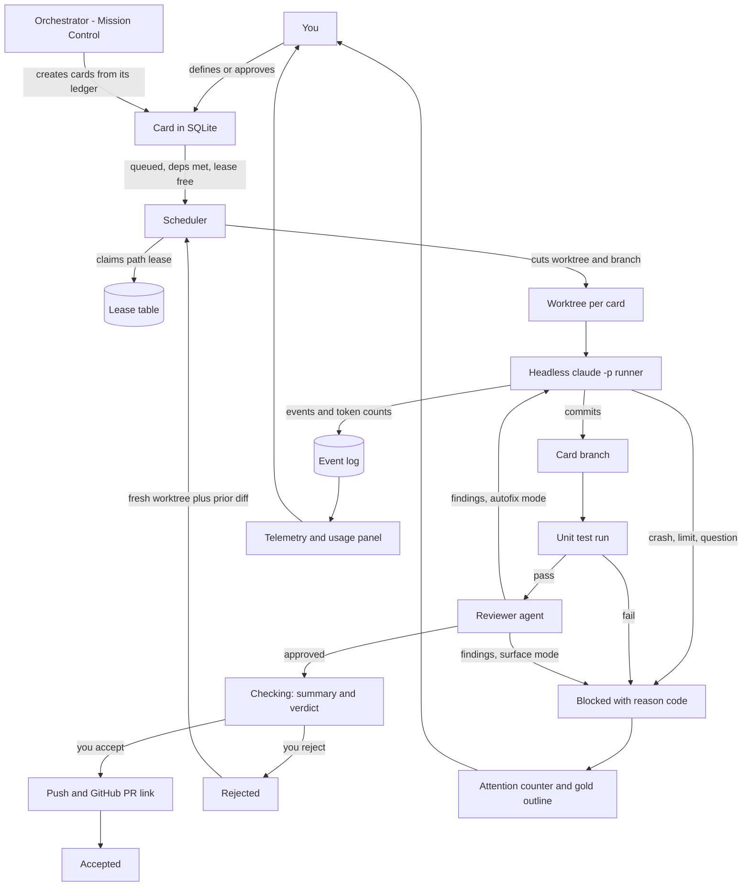

# smortboard — implementation plan

## Context

Fabian wants to get good at defining work precisely and then leaving it alone. Today that means
hand-running Claude Code sessions, hand-cutting worktrees (wowtomate already carries three under
`.claude/worktrees/`), and hand-tracking state in `TASKS.jsonl`. It works, but it demands presence:
the work only moves while he is watching it.

smortboard is a convenience wrapper around coding agents that removes that requirement. Cards are
defined in detail up front, handed to headless Claude Code sessions running in isolated worktrees,
and surfaced back only when they need a decision. It is explicitly **not** a harness — it does not
reimplement the agent loop, it schedules and observes one.

The design test for every feature: does it help him walk away? Anything that rewards hovering is
wrong.

Source brief: `smortboard/dev-board-brief.md`. All `[OPEN]` and `[FLAG]` items in it are resolved
below.

---

## Locked decisions

| Area | Decision |
|---|---|
| Execution | Headless Claude Code (`claude -p`) per card. Ollama deferred. |
| Credential | The interactive subscription seat. Contention parks the card for attention. |
| Isolation | One git worktree + branch per card. Repo is a card attribute; a board declares its repos. |
| Concurrency | Parallel by default, as far as leases and the seat allow. |
| Store | SQLite, gitignored. `smortboard export` produces a portable bundle on demand. |
| History | Retained. Append-only event log per card. |
| Truth | Cards are ground truth. The orchestrator keeps its own plan ledger, derived from and reconciled against them. |
| Statuses | To do / Doing / Checking / Accepted / Rejected. **Blocked is not a sixth status** — a card keeps its status and raises a nullable reason code, which draws the gold outline. |
| Gate to Checking | Unit tests pass **and** reviewer approves. |
| Merge | Board pushes and links the GitHub PR. Board never merges. |
| Rejection | Fresh worktree from base, plus a read-only diff of the failed attempt. |
| Outputs | Always a git commit — decisions and documents included. |
| Prompts | Layered by **role** only: orchestrator, worker, reviewer. |
| UI | ui_base first, domain-free vocabulary. Git pin, sha while co-developing. PyPI whenever it chafes. |
| Packaging | `uv tool install smortboard`, a native local app. Docker isolates cards, it is not how the board ships. |
| Isolation | One throwaway container per card, with a clone bind-mounted and a card-scoped token. No GitHub credential inside. **Docker is a hard dependency — there is no fallback.** |
| Out of scope | Ollama, workstream column mode, scheduling/digest, Omarchy, fish_gate. |

### Resolved from the brief's open flags

- **§4.2 mode switch** — a `.toggle` in the top bar, key `g`. Workstream mode ships after v1.
- **§5 modifier scheme** — `,` opens Workforce (left), `.` opens Mission Control (right). Both
  `Cmd+←` and `Alt+←` are browser Back on some platform, so neither is capturable in a browser-based
  app. Brackets were the first proposal and were wrong: they need AltGr on several European layouts.
  **All keyboard bindings resolve on `event.code`, not `event.key`** — the physical key position is
  layout-independent, and only the printed character moves. The shortcut overlay (`s`) labels keys
  from `navigator.keyboard.getLayoutMap()` where available, falling back to the US character.
- **§5 focus model** — a panel sliding in leaves focus on the board. `/` enters its input. `Esc` is
  always exactly one level back: input → panel → closed.
- **§5 card-open arrows** — arrows move between the open card's sections, not between columns.
- **§5 globals** — `u` (usage dropdown), `a` (agent roster) and `s` (shortcut overlay) work
  everywhere; none takes text input.
- **§4.1 boards** — `←`/`→` on the top bar, and `1`–`9` jump directly (a jump animates as if the
  target were adjacent, rather than scrolling through the boards between).
- **§4.4 empty workforce panel** — hazard stripes with "no card selected".
- **§6 naming** — `.rubber-band` in ui_base already means the shift-drag selection net. The focus
  motion is a new component, `.focus-marker`.
- **§11 scheduling** — reinterpreted as a daily digest over cards, not recurring cards. Post-v1.
- **§12 Omarchy** — dropped. A plugin is a QML/Quickshell bar widget or panel and cannot be a
  standalone application, so it could only ever have been a small status indicator pointing at the
  board. Not worth the surface area.

---

## Architecture



### Blocked reason codes

`CRASH`, `USAGE_LIMIT`, `LEASE_CONFLICT`, `AGENT_QUESTION`, `TESTS_FAILED`, `REVIEW_REJECTED`,
`DEPENDENCY_REJECTED`. The code drives what the attention entry says and whether a retry is
automatic. Mirrors the `blocked_reason_code` convention already in `TASKS.jsonl`.

It is a **flag, not a column**. Corrected during Phase 1: this plan originally made `blocked` a
sixth status, which left a blocked card with no bucket to render in and discarded the status it
blocked from. The brief said so all along — §4.2 lists five columns, §4.3 makes attention an
outline.

### Repo layout

```
smortboard/
  smortboard/
    store/        sqlite schema, migrations, export
    exec/         worktree manager, lease store, claude runner, event log
    review/       test runner, reviewer agent, merge request builder
    orchestrate/  mission control session, role prompts, orchestrator ledger
    server/       http api, asset serving (own files first, ui_base fallback)
    ui/           configuration of ui_base components only - no new UI primitives
  tests/
  docker/
```

`ui/` holds wiring, not widgets. Any visual primitive that does not exist goes to ui_base. This is
the brief's hard constraint and it is load-bearing for the whole plan.

---

## Spikes — before Phase 2 locks

Each names what would confirm the assumption and what would falsify it. The plan is provisional
until all three have run.

**S1 — CONFIRMED 2026-09-08, see `docs/spikes/S1-S2-findings.md`.** Run one real card end to end in a scratch worktree.
*Confirms:* `claude -p` accepts a prompt, runs to completion non-interactively, emits parseable
events, reports token counts, and commits. *Falsifies:* it needs a TTY, cannot report tokens, or
gives no completion signal distinguishable from a crash — any of which forces the Agent SDK instead,
and re-plans Phase 2 entirely.

**S2 — CONFIRMED 2026-09-08, see `docs/spikes/S1-S2-findings.md`.** Run two headless sessions against the one interactive
subscription seat while it is in use. *Confirms:* they queue or fail cleanly with a detectable
signal we can map to `USAGE_LIMIT`. *Falsifies:* they degrade silently or corrupt the interactive
session — which makes parallelism (Phase 5) dependent on separate credentials, not just leases.
**Outcome:** both sessions completed cleanly with no interference, so parallelism is a scheduling
problem rather than a credentials one. Quota turned out to be readable directly from each card's
`rate_limit_event` — five-hour and seven-day utilisation with reset times — so §4.6 is fully
buildable and the earlier assumption that only the status line exposes it was wrong. Caveat:
utilisation stayed at 0.11, so this proves concurrency and a readable signal, not behaviour at the
limit.

**S3 — CONFIRMED 2026-09-08, see `docs/spikes/S3-findings.md`.** A `PreToolUse` hook matched on
`Edit|Write` sees `file_path` before the write lands and blocks it with exit 2. Verified: the
in-lease edit was written, the out-of-lease edit was refused and the file left unchanged. The
refusal is distinguishable three ways — `hook_response` with `exit_code: 2` and our own
`LEASE_CONFLICT:` message on stderr, `result.permission_denials` carrying the exact path, and the
agent's own report. Leases are enforceable at write time, not advisory.

---

## Phases

Each phase is independently shippable and testable. **v1 is Phases 0–6.**

### Phase 0 — ui_base foundations

Ships as ui_base `v0.2.0`. Domain-free naming throughout: no `card`, `board`, `kanban`, `agent`.
Only what Phase 1 needs; the drawer, meter and log arrive in later phases.

```
unit:     bucket layout with 2D roving focus
expects:  a container, an ordered list of buckets, each with an ordered list of row elements
does:     lays buckets side by side and owns arrow-key focus movement across two axes, including
          the escape upward out of the first row
outputs:  focus events naming bucket and row; a `moveTo(bucket, row)` API
verifies: five buckets, three rows each. Right from bucket 1 row 2 lands on bucket 2 row 2. Up from
          any row 0 emits `exit-top` rather than moving. Left from bucket 0 does not wrap.
```

```
unit:     expander
expects:  a strip element, a collapsed aspect ratio and an expanded one
does:     animates a landscape strip into a centred portrait panel and back; dismiss on outside
          click and on Escape
outputs:  open/close events; the panel element for the host to fill
verifies: a 3:1 strip opens to a 1:3 panel centred in the viewport within the animation duration;
          a click on the backdrop closes it; Escape closes it; neither fires twice.
```

```
unit:     count badge
expects:  a host element and a number
does:     renders a count indicator, hidden at zero
outputs:  none beyond the DOM
verifies: value 0 renders nothing visible; value 3 renders "3"; value 100 does not change the host
          element's height.
```

```
unit:     focus marker
expects:  the element focus is moving to
does:     glides a cream highlight from the previous focused element to the new one
outputs:  none
verifies: moving focus across a bucket boundary animates once, not twice, and the marker ends
          exactly on the target's border box.
```

```
unit:     hazard stripes
expects:  a container and a label
does:     fills it with a diagonal striped placeholder carrying the label
outputs:  none
verifies: renders in both light and dark theme using tokens only, no colour literals.
```

**Ships when:** `uv run pytest` passes in ui_base, the asset tests cover the new files, and a demo
page exercises all five.

### Phase 1 — the board, no agents

A usable manual kanban. No agent touches anything yet, which makes every later phase's failures
unambiguously about execution.

- SQLite schema and migrations: boards, repos, cards, attributes, attachments, dependencies, events.
- `smortboard export` writing a portable bundle.
- HTTP server, serving own `ui/` files first with ui_base as fallback, per ui_base's documented
  pattern.
- Card CRUD with every §7 field except telemetry: title, workstream, status, description, tasks,
  acceptance criteria, dependencies both directions, attachments, comments, review flag.
- Kanban columns, card strip and expanded panel, wired from Phase 0 components.
- The full keyboard model as resolved above.
- Docker image.

**Ships when:** the whole-system test below runs up to "card exists and is navigable", cards survive
a container restart, and `export` round-trips.

### Phase 2 — one card executes

Depends on S1 and S3.

- Worktree manager: cut, track and destroy a worktree + branch per card, in the card's repo. The
  agent is handed a checkout **already on its branch** — S1 and S3 both showed a card left on main
  will either name its own branch or deadlock asking permission to make one.
- Decide what a card run inherits from the operator's configuration, and scope it deliberately.
- Lease store: paths claimed at card definition, enforced by the mechanism S3 establishes.
- Claude runner: headless `claude -p` in the worktree, streaming events into the event log.
- Blocked state with reason codes; gold outline; attention counter.
- Stop button, and "pause and review with orchestrator". No mid-flight card edits.

**Ships when:** one card runs unattended, commits to its branch, and reaches Checking or Blocked
with a correct reason code.

### Phase 3 — the gates

**Two gates, and they answer different questions.** Keeping them apart is the point of having two:

| gate | question | input |
|---|---|---|
| unit tests | did it do the thing that was asked? | the acceptance criteria |
| reviewer | is the code safe and decent? | the diff |

**The reviewer does not judge acceptance criteria.** The tests do that, and they were written from
the criteria before the work started. The reviewer reads the diff and answers four questions and no
others:

- **vulnerabilities** — injection, unsafe deserialisation, path traversal, unchecked input
- **leaked credentials** — a key, token or password reaching the diff at all
- **best practices** — the project's own conventions, and the language's
- **efficient coding** — work done repeatedly that could be done once, and obvious waste

This is why criteria are immutable and tests come first. A reviewer that also judged "did it meet
the criteria" would be judging a target the same run could have moved; splitting them means each
gate has something fixed to measure against.

```
pass the card's path lease into the prompt, not only into the guard - see "What a card is, and
  what it costs": it is navigation the agent is currently denied
pass --max-budget-usd, defaulting from the board, so a runaway card is refused rather than found
  on the bill
unit test runner per card, from the acceptance criteria - THE BOARD RUNS IT, NOT THE AGENT: an
  agent reporting "tests pass" is grading its own homework, and a card that convinced itself is the
  case a gate exists to catch. it re-runs the repo's own command against what the card committed,
  in a container the agent never touched, with the work mounted READ ONLY and --network none. that
  independence is free: the gate makes no model call, so it needs no credential either
reviewer agent over the diff, on the four questions above
review setting per card with a global override: findings auto-fixed by the worker, or surfaced
  through attention
worker summary and reviewer verdict rendered on the card
merge request: push the branch and OPEN THE PULL REQUEST with gh, title and body written. never
  merge - that is Fabian's, and the hook refuses it anyway
rejection: destroy the worktree, cut fresh from base, attach a read-only diff of the attempt
dependent cards of a rejected card take the attention colour for review
```

**Ships when:** the whole-system test passes end to end, including a card whose reviewer finds
something and whose card lands in attention rather than in Checking.

### Phase 4 — Mission Control

- ui_base: the sliver drawer component.
- Orchestrator session, role-layered prompts (orchestrator / worker / reviewer), versioned in the
  store and editable in the UI.
- Orchestrator ledger: its own plan, reconciled against cards on each update. Cards stay ground
  truth; the ledger is how it plans rather than how it records.
- Orchestrator creates cards directly; Fabian amends.
- `.` toggles the panel; workforce drawer ships as hazard-striped placeholder.

**Ships when:** a conversation in Mission Control produces cards on the board that pass Phase 3.

### Phase 5 — parallelism

Depends on S2.

- Multiple cards executing concurrently, bounded by lease conflicts and seat contention.
- Dependency-ordered scheduling.
- Seat contention parks a card as `USAGE_LIMIT` rather than failing it.
- Resume briefing: a card resuming after a break is handed its event log's summary — what changed,
  what is next, which file to open — instead of re-ingesting the worktree. Toggleable per Fabian's
  §2 request.
- **Agent roster** — a named button in the top bar, key `a`, opening a popup listing every agent
  currently holding a card.

```
unit:     agent roster
expects:  the set of cards currently held by an agent, and each one's event log
does:     renders one row per agent - card title as the label, a one-line current activity as the
          row's `stats`, `on` while working and `disabled` while blocked - and jumps to a card when
          its row is picked, exactly as the attention list does
outputs:  a `Menu` `list` section; a card-selected event
verifies: three cards running and one blocked renders four rows, the blocked one disabled and
          carrying its reason code. Picking a row opens that card in the main view. With no agent
          holding a card the popup says so rather than opening empty.
```

The one-line activity is **derived from the event stream, not asked for.** The most recent tool use
already reads as a summary — "editing exec/runner.py", "running the test suite" — so it costs no
tokens and no latency. Asking each agent to describe itself would spend money to learn something
the stream already says.

This needs no new ui_base component: a `Menu` `list` row already carries `label`, `stats`, `on`,
`disabled` and an `action`, which is exactly the shape of a roster row.

It belongs in Phase 5 because that is when it earns its place — with one card running at a time the
board itself already tells you everything the roster would.

**Ships when:** three cards across two repos run concurrently, all three merge cleanly, and the
roster shows all three with an accurate one-line activity for each.

### Phase 6 — telemetry and workforce

- ui_base: log component, quota meter.
- Workforce panel, `,`, defaulting to the **result** view — diff, files touched, last decision,
  summary — with the live stream a deliberate second press. This inverts §4.4's stated default on
  purpose: §1 says watching is a failure mode, and the panel as briefed rewards it.
- Telemetry section per card, `i`: model per task, input/thinking/output tokens.
- `u` usage dropdown, built from ui_base `Menu` with columns and dividers, projecting
  `rate_limit_event.unifiedWindows` — five-hour and seven-day utilisation and reset times.

**Ships when:** token counts reconcile against the event log for a completed card.

### After v1

Workstream column mode; Ollama plus the documented board transport protocol; daily digest.

---

## Documentation, per §13

Each phase ships its own API documentation as part of the phase, not afterwards: the HTTP API in
Phase 1, the event log schema and runner contract in Phase 2, the review and merge contracts in
Phase 3, the prompt layering in Phase 4. The board transport protocol is written when Ollama
arrives, not before — writing it against a single provider would fossilise Claude's semantics as the
spec.

---

## Whole-system test case

The smallest scenario exercising the assembled units, not each in isolation:

> A card titled "add a `--version` flag to the smortboard CLI", repo `smortboard`, with acceptance
> criteria "running `smortboard --version` prints the version from `pyproject.toml` and exits 0",
> and a path lease on `smortboard/cli.py`.

Expected: the card moves To do → Doing, gets a worktree and branch, is worked by a headless Claude
Code session that commits, has its generated unit test executed and passed, is approved by the
reviewer, and arrives in Checking carrying a worker summary and a reviewer verdict. The merge button
yields a GitHub PR link. Accepting moves it to Accepted; rejecting destroys the worktree, cuts a
fresh one, and attaches the prior diff.

This is what catches a wrong seam — a runner that commits but reports no tokens, a lease that is
claimed but never released, a reviewer that approves before tests finish.

## Verification

- `uv run pytest` in both repos; ruff clean before every commit.
- ui_base asset tests extended per Phase 0 — serving what it should not, failing to serve what a
  consumer links, shipping broken CSS or JS.
- The whole-system test run against the smortboard repo itself, which is also the dogfood case: the
  board's own first workstream spans smortboard and ui_base, which is exactly why repo is a card
  attribute.
- Docker image builds and the board survives a container restart with state intact.

## The containment decision

**A card will eventually read input nobody wrote for it** — an issue body, a fetched page, a
dependency's README. That makes prompt injection a real path rather than a theoretical one, and it
is the fact that decides this section. Against a merely confused agent almost anything is adequate;
against an injected one, only a boundary it cannot argue with is.

### The board runs natively, and that is the safer choice

A containerised board that starts card containers needs the Docker socket, which is root-equivalent
on the host. A native board runs with the user's own privileges. **The container was never
protecting the operator from the board — it protects them from the cards**, so moving the board out
of Docker removes a root-shaped hole and costs nothing.

It ships as `uv tool install smortboard`, or `uvx smortboard` with no install at all. One command,
no virtualenv to manage, and `uv` is already the house toolchain.

### A card gets a container, a clone, and no way to reach GitHub

- a **clone** rather than a worktree, because a worktree's `.git` is a pointer file into the parent
  repo: mount only the worktree and git is dead, and committing is the card's whole job
- the clone is bind-mounted, so the commits are on the host's disk the moment the container exits
- a card-scoped credential from `claude setup-token`, mounted read-only. Never an environment
  variable, which `docker inspect` shows to anyone who can run it
- **no GitHub credential at all.** The card commits locally; the board fetches, runs the gates,
  pushes and opens the pull request from the host where the operator's rules apply

That last point is what actually protects `main`, and it is structural rather than a rule: the
guard that refuses a push to main lives in the operator's user settings, and a card runs with
`--setting-sources project` and never sees it. A card that cannot reach GitHub cannot write main
whatever it decides to do.

### Shared tools, isolated cards

The toolchain lives in **one image per repo**, declared on the repo alongside its `test_command`.
A fresh container per card would otherwise pay for `uv sync` or `npm install` on every single run —
not a second, but minutes, on every card. Baked into the image, a card's container costs about a
second to start.

**A shared package cache was the cheaper option and is deliberately not used.** A cache mounted
writable across cards is a surface every later card reads, so one injected card poisons the next —
which is exactly the cross-card contamination the per-card container exists to prevent. An image is
read-only; a cache is not.

Per-card rather than per-repo containers, for two reasons beyond isolation. **Lifecycle:** a
container that lives and dies with its card needs no process management, no idle cleanup, and no
answer to "one card wedged the container two others are using". **And it costs no disk:** two cards
on one repo are on different branches, so they need separate checkouts either way — sharing a clone
would put them back on a shared `.git`, where one card can rewrite another's refs.

### One card runtime, and Docker is a hard dependency

**There is no second mode.** A card runs in a container or it does not run. If Docker is missing, or
the card credential is not configured, the board refuses and says how to fix it rather than starting
the card some other way.

That is deliberate and it is the whole point of the decision above. A subprocess fallback would put
an agent that may have read untrusted input onto the operator's own filesystem, with the operator's
own credential and their own GitHub access — which is precisely what the container exists to
prevent. A board that quietly degraded would be claiming an isolation it no longer had, and the
person relying on it would have no way to know.

So Docker joins `uv` as something you install once, and `require_card_runtime()` is the only way to
get a runtime.

### What a container still does not solve

- **the network is open.** The run has to reach the API, so `--network none` is not available.
  Restricting egress to that one host is possible inside a container and impractical outside one,
  which is a reason to have the container rather than a claim about what it already does
- **the token is inside it.** A container is a filesystem boundary, not a credential one. What
  protects the credential is that it is a *separate* one: a card token can be revoked without
  touching the operator's own session

## What a card is, and what it costs

### A card is a feature, not an edit

A card is a unit of work with an outcome and a list of tasks that get there: *"wowtomate needs a new
tab, here is what it shows, here is how it behaves."* Not *"change this sentence."*

That is a design choice, and it is also the cheaper one, which is not obvious. **The token cost of a
run is turns multiplied by context-per-turn, and there is a floor.** Measured on a real card: 13
turns, 209,503 cache-read tokens, and only 22 tokens of genuinely new input — roughly 16k of system
prompt and tool definitions re-read on *every* turn, before the card does anything at all. A
three-turn card pays about 48k to accomplish almost nothing.

So slicing work into many tiny cards is actively wasteful: you pay the fixed overhead again for each
one, and none of them learn from the last. The board's own affordances make small cards tempting;
the cost floor is the reason not to.

### Where a feature-sized card gets expensive instead

The opposite failure. A long card's context grows as it reads, and **a file read on turn 2 is
re-read from cache on every turn after it** — read one big file early in a fifty-turn card and you
pay for it fifty times. The tax compounds in a way it never does for a short card.

Which makes three things load-bearing rather than nice:

- **the task list is the convergence mechanism.** An agent working through stated tasks does not
  explore, and exploration is what multiplies turns
- **`--max-budget-usd`**, which `claude -p` accepts and the runner does not yet pass. A budget turns
  "a card looped and burned forty dollars" from a discovery on the bill into a refusal. It belongs
  on the card, defaulting from the board
- **acceptance criteria written before the work**, which is already the rule for the test gate, and
  is what stops a card wandering past its outcome

**Unresolved:** a card large enough may exhaust its context window before finishing. Nothing handles
that today. The honest options are compaction inside the run, or the board splitting the card — and
neither should be designed before a real card actually hits it.

### Measured, on the same card twice

The first guess was that the path lease in the prompt would be the big saving. It was not, and the
experiment says so plainly. Running one card, then fixing what the transcript showed and running the
identical card again:

| | before | after |
|---|---|---|
| turns | 32 | 16 |
| cost | $0.347 | $0.235 |
| cache reads | 728,877 | 336,530 |
| permission denials | 10 | 4 |
| outcome | `AGENT_QUESTION` | completed |

**The cost was permission denials, not exploration.** The default allowlist had no `Glob` or `Grep`,
so the agent reached for `Bash grep`, was refused, and then tried reworded variants of every blocked
command — ten refusals across thirty-two turns, before giving up and asking a question nobody was
there to answer. Granting two read-only tools and adding one sentence — *a refused command will not
succeed reworded* — halved the run.

**The lease preamble's effect remains unmeasured**: it was present in both runs, so this says
nothing about it either way.

Four denials remain, and they are the same shape: the card cannot execute anything to check its own
work, because no repo declared a `test_command`. That is the next thing to measure, and it matters
for Phase 3 rather than only for cost — a test gate needs a card that can run tests.

### The levers, in the order they matter

1. **Fewer turns.** The path lease is computed and then *hidden from the agent*, used only to refuse
   writes. Putting it in the prompt turns a security mechanism into navigation, for free, and is the
   cheapest change available.
2. **Smaller context per turn**, because it compounds. The per-repo `allowedTools` scoping shrinks
   every turn, not just the first.
3. **A budget ceiling**, as above.
4. **The reviewer reads the diff, not the repo** — already decided, and this is a second reason for
   it.

Two things already true and worth not breaking: the repo's own `CLAUDE.md` is inherited through
`--setting-sources project`, so a good one prevents exploration; and every run's `usage` and
`total_cost_usd` already land in the event log, so cost per card is measurable rather than guessed.
**Instrument before optimising** — the numbers above come from two runs on a one-file repo, which is
not a real codebase.

### A card is not a conversation

Worth stating because the two get conflated. The API is stateless: every turn re-sends the whole
context, in a card exactly as in an interactive session. The difference is across runs, not within
one. A long session amortises understanding and pays a per-turn tax that grows without limit; a card
starts small, stays small, and learns nothing from the card before it. Neither is simply cheaper —
they trade reuse against boundedness, which is why the Phase 5 resume briefing hands a card a
summary rather than letting it re-derive.

## Risks

- **A card is not contained, only guided.** The lease hook stops writes outside the card's paths and
  a Bash guard stops the obvious escapes, but shell is arbitrary and a determined command gets out.
  Real containment means running the card in a container — and a git WORKTREE IS NOT SELF-CONTAINED:
  its `.git` is a pointer file into the parent repo, so mounting only the worktree leaves git dead
  and the card unable to commit. That forces a choice, which belongs to Phase 5 when parallelism
  makes it matter:
  - **mount the parent repo** — git works, the scope is the repo, and the lease stays what keeps one
    card out of another's worktree
  - **clone per card** — genuinely self-contained and mounts cleanly, at the cost of disk and a few
    seconds per card
  Two things a container does not solve either way: the card needs the CLI and an authenticated
  token inside it, so the subscription seat crosses the boundary by design; and network cannot be
  off, since the run has to reach the API. The boundary is filesystem and process, not credential
  and not network.
- **Everything a card needs must be in the repo**, which is a good contract and makes the container
  reproducible — with the standing exception that secrets are mounted, never committed.


- **S1 falsified** — headless Claude Code cannot be driven per card. Forces the Agent SDK and
  re-plans Phase 2. Highest-impact unknown; spike first.
- **One seat, parallel cards** — S2 decides whether Phase 5 is a scheduling problem or a credentials
  problem.
- ~~Lease detection after the fact~~ — **closed by S3.** Enforcement happens at write time via a
  `PreToolUse` hook.
- **Ambient configuration inheritance** — a card run inherits the operator's global CLAUDE.md, hooks
  and permissions, and `--settings` adds to them rather than replacing them. In S3 this made a card
  stop and ask permission to create a branch instead of working. Phase 2 must decide explicitly what
  a card inherits (`--setting-sources`, `--system-prompt`) rather than letting it be ambient.
- **ui_base gating** — every phase's UI depends on ui_base landing first. Additive components mean
  wowtomate needs no pin bump, but a signature change would break it.
