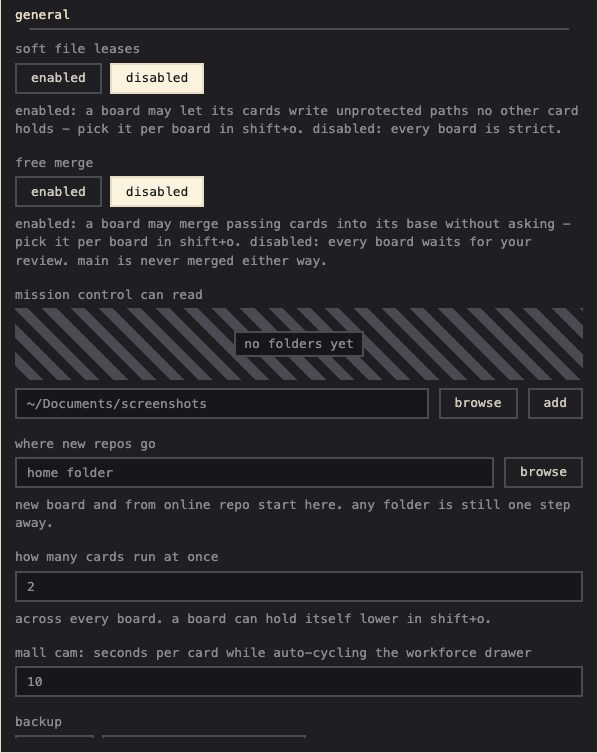
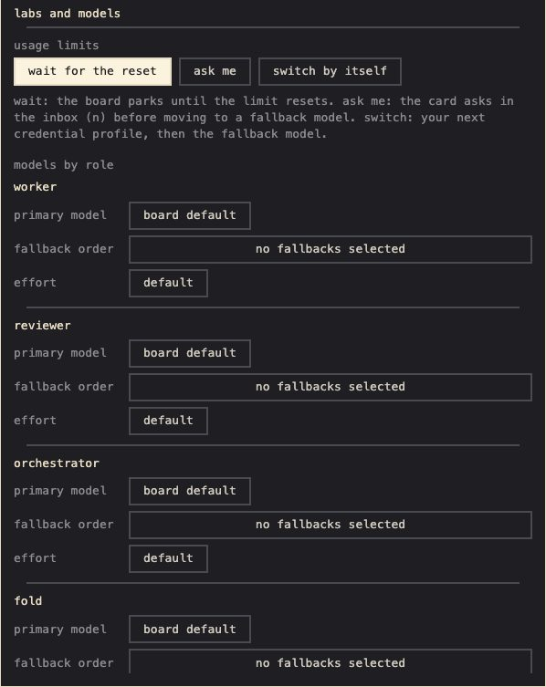
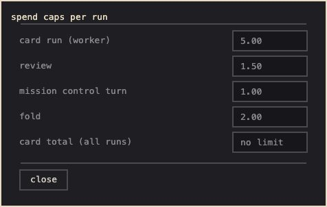

# Configuration

## Flags and environment

| Flag | Env | Default |
|---|---|---|
| `--port` | `SMORTBOARD_PORT` | `8000` (`8001` with `--demo`) |
| `--host` | `SMORTBOARD_HOST` | `127.0.0.1` |
| `--db` | `SMORTBOARD_DB` | user data dir |
| `--no-browser` | | opens a tab |
| `--demo` | | off |
| `--version` | | |
| | `SMORTBOARD_CARD_IMAGE` | `smortboard-card:latest` |
| | `SMORTBOARD_CARD_TOKEN_PATH` | `~/.config/smortboard/card_token` |
| | `SMORTBOARD_OPERATOR_NAME` | your `git config user.name` |

A flag beats the matching `SMORTBOARD_*` env var, which beats the default.

## The data directory

**The database lives in the platform's user data dir, never the working directory.** On macOS that
is `~/Library/Application Support/smortboard`, the equivalent elsewhere. Created mode 700, it holds
`smortboard.db`, so running the board from anywhere scatters no database files.

Configuration and tokens live apart, under `~/.config/smortboard` (`%APPDATA%\smortboard` on
Windows). See [Credential files](credentials.md).

## The settings panel

**`o` holds what every board shares. `shift`+`o` holds one board's own.**

`o` has three groups. General: soft file leases and free merge (enabled or disabled), folders
mission control can read, where new repos go, how many cards run at once, the mall cam interval,
backup and the mouse. Labs and models: what a usage limit does, and the lab, model, fallbacks and
effort per role. Cost control: spend caps per run and per card.

<table><tr>
<td width="33%"> general: how it behaves</td>
<td width="33%"> labs and models: who runs what</td>
<td width="33%"> cost control: what it may spend</td>
</tr></table>

Each is a stored setting:

| Kind | Keys |
|---|---|
| lab and model per role | the `*_lab` and `*_model` pairs, and their `*_cross_lab_fallback` lists |
| effort per role (unset passes no effort flag) | `worker_effort`, `reviewer_effort`, `orchestrator_effort`, `fold_effort` |
| what a usage limit does: unset waits for the reset, `attention` asks in the inbox, `switch` moves to the next credential profile, then the fallback model | `usage_limit_route` |
| spend cap per run | `worker_budget_usd`, `reviewer_budget_usd`, `orchestrator_budget_usd`, `fold_budget_usd` |
| spend cap per card, across every run | `card_total_budget_usd` |
| absolute paths mission control may also read | `mission_control_read_paths` |
| per-board mode gates: `on` or unset. Unset refuses the mode; turning one off resets every board to strict or review | `allow_soft_leases`, `allow_free_merge` |
| where new board and from online repo open their folder picker (unset: home) | `repos_home` |
| cards run at once across the install (unset: 2) | `max_parallel` |
| workforce drawer auto-cycle, seconds (unset: 10) | `mall_cam_interval_seconds` |
| pointer affordances: hover focus, right-click menu (unset: keyboard only) | `enable_mouse` |
| the rest | `findings_route`, `resume_briefing`, `gate_timeout_seconds` |

Per board, in `shift`+`o`: merge mode (review or free), file lease (strict or soft), cards at once
and a daily budget in USD. Free and soft are only on offer while their switch in `o` is enabled.
`shift`+`a` also flips the merge mode, after a confirmation.
