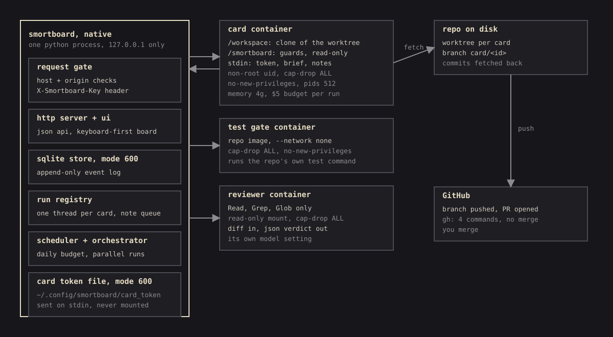

# Security

**Agents here spend money and push code. The board keeps the browser and the agents in their lane.**

## The board itself

- **Loopback and keyed.** It binds `127.0.0.1`. Every `/api/` call needs the key in
  `~/.config/smortboard/api_key` (mode 600), sent as the printed link's cookie or an
  `X-Smortboard-Key` header. A foreign `Host` (DNS rebinding), a cross-site `Origin` or a non-json
  body is refused before any route runs. `--host` is an explicit opt-in; the key is not network
  authentication.
- **Strict Content-Security-Policy.** Scripts and styles load only from the board's own files, so
  agent text never runs as code in your tab. Agent labels render as text, attachments always
  download, and only `http(s)` links become links.
- **Bounded requests.** JSON bodies cap at 1 MB, uploads at 25 MB, sockets time out after 30 s.
  Image builds run off the request thread.
- **Private data.** The database holds full agent transcripts, created mode 600 in a mode-700
  directory.

## The agents

- **Sealed containers.** Non-root, `--cap-drop=ALL`, `no-new-privileges`, memory and process limits.
  No Docker socket, home directory, `~/.ssh`, `~/.claude` or `~/.codex`. The test gate has no network; reviewer
  and orchestrator mounts are read-only. Without Docker a card refuses to run.
- **Token on stdin.** Never on the `docker` command line, never mounted, never in `docker inspect`.
  In the container it reaches only the agent: the `claude` process, or for Codex an `auth.json`
  in the container's memory-backed `CODEX_HOME`.
- **Guards the agent cannot touch.** The lease hook covers Edit and Write. A bash guard allows only
  git and the repo's own test and lint commands, and refuses git's option tricks (`-c`,
  `--upload-pack` and friends). Both sit read-only in a temporary folder outside the repo. A soft
  lease never reaches agent settings, CI, agent instructions, build and dependency files or secrets
  unless the card's own lease names them.
- **Only the tools a role needs.** A worker loads read, edit, write, two searches and a shell.
  Reviewer, mission control and fold load read and the searches. Skills and slash commands are off
  for every run.
- **Proof from outside the agent.** Tests re-run offline, the reviewer can only read, and only a
  note carrying the run's own marker counts as you.
- **No path to `main`.** The board lands a card on `development` itself, but `integrate` and the
  push both refuse `main`, `master` and `trunk`, and `gh pr merge` is not on the allowlist.

## Architecture

<picture>
  <source media="(prefers-color-scheme: light)" srcset="../images/art-architecture-light.svg">
  
</picture>

The board is one plain Python process: a stdlib HTTP server, SQLite, and plain JavaScript on
[smortui](https://github.com/BalthazarFitzpatrick/smortui), pinned by commit, no build step. Only
the agents are contained: a containerised board would need the Docker socket, which amounts to root
on the host.
