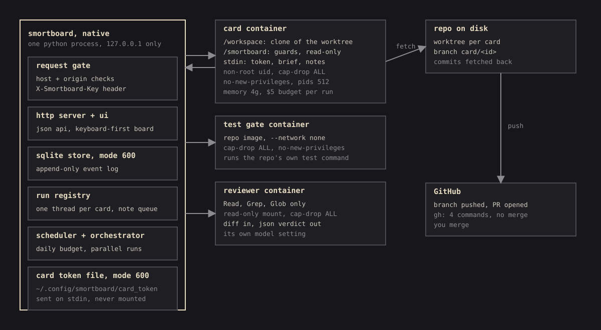

# security

**agents here spend money and push code. the board keeps the browser and the agents in their lane.**

## the board itself

- **loopback and keyed.** it binds `127.0.0.1`. every `/api/` call needs the key in
  `~/.config/smortboard/api_key` (mode 600), sent as the printed link's cookie or an
  `X-Smortboard-Key` header. a foreign `Host` (dns rebinding), a different `Origin` scheme, host
  or port, or a non-json
  body is refused before any route runs. `--host` is an explicit opt-in; the key is not network
  authentication.
- **strict content-security-policy.** scripts and styles load only from the board's own files, so
  agent text never runs as code in your tab. agent labels render as text, attachments always
  download, and only `http(s)` links become links.
- **bounded requests.** json bodies cap at 1 mb, uploads at 25 mb, sockets time out after 30 s.
  image builds run off the request thread.
- **private data.** the database holds full agent transcripts, created mode 600 in a mode-700
  directory.

## the agents

- **sealed containers.** non-root, `--cap-drop=ALL`, `no-new-privileges`, memory and process limits.
  no docker socket, home directory, `~/.ssh`, `~/.claude` or `~/.codex`. the test gate has no network; reviewer
  and orchestrator mounts are read-only. without docker a card refuses to run.
- **independent git objects.** card clones use git's transport instead of local hardlinks or
  borrowed objects. making the container's clone writable cannot change source object permissions.
- **token on stdin.** never on the `docker` command line, never mounted, never in `docker inspect`.
  in the container it reaches only the agent: the `claude` process, or for codex an `auth.json`
  in the container's memory-backed `CODEX_HOME`.
- **guards the agent cannot touch.** the lease hook covers `Edit` and `Write`. a bash guard allows only
  git and the repo's own test and lint commands, and refuses git's option tricks (`-c`,
  `--upload-pack` and friends). both sit read-only in a temporary folder outside the repo. a soft
  lease never reaches agent settings, ci, agent instructions, build and dependency files or secrets
  unless the card's own lease names them.
- **only the tools a role needs.** a worker loads read, edit, write, two searches and a shell.
  reviewer, mission control and fold load read and the searches. skills and slash commands are off
  for every run.
- **proof from outside the agent.** tests re-run offline, the reviewer can only read, and only a
  note carrying the run's own marker counts as you.
- **no path to an off-limit branch.** the board lands a card on `development` itself by merging the
  card's pull request, and `integrate` refuses the board's off-limit branches: `main`, `master` and
  `trunk` unless its list says otherwise. the switch in `o` can lift every list; that is the
  operator's decision, never an agent's. `gh pr merge` never runs with `--auto` or `--admin`, and no
  branch is ever force-pushed.

## ui screenshots

ui review stages the running host's trusted backend and overlays only the card's ui files.
symlinks in that overlay are refused. the temporary board contains invented cards, no connected
repo, and a private api key and config. no scheduler starts.

headless chromium authenticates to that temporary board and waits for cards before capturing.
request interception permits only that board's assets and read-only board data; other origins,
mutations, host discovery, service workers and websockets are blocked. this browser policy is
defense in depth, not an operating-system network sandbox. ci also runs the real captures in a
read-only container with `--network none` and no unrelated host mounts.

## architecture

<picture>
  <source media="(prefers-color-scheme: light)" srcset="../images/art-architecture-light.svg">
  
</picture>

the board is one plain python process: a stdlib http server, sqlite, and plain javascript on
[smortui](https://github.com/BalthazarFitzpatrick/smortui), pinned by commit, no build step. only
the agents are contained: a containerised board would need the docker socket, which amounts to root
on the host.
